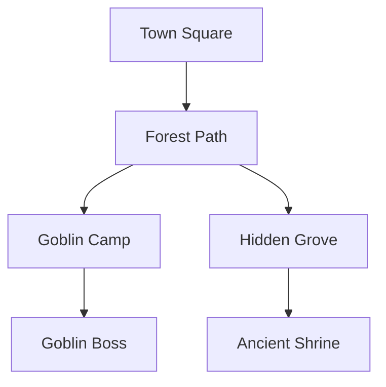
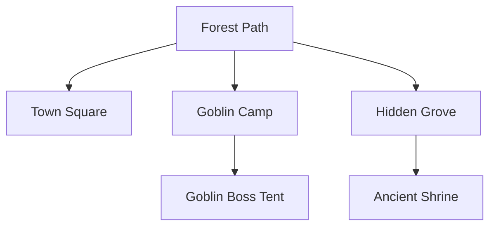

Enable modular encounter and location navigation using wikilinks as nodes to build interconnected point crawl structures.

## Purpose

A **point crawl** is a modular way to design interconnected locations and encounters where:
- Each location/encounter is a **node** (represented by a wikilink)
- **Connections** between nodes are defined by which wikilinks appear in each location file
- Players choose which node to visit next based on available connections
- DM can easily add, remove, or modify nodes without breaking the structure

## How It Works

### 1. Node Structure

Each node is a markdown file with:
- **Frontmatter** - Basic metadata
- **Description** - What players see/experience
- **Connections** - Wikilinks to other accessible nodes
- **Encounter/Event** - What happens here

Example node file (`Locations/Wilderness/Forest_Path.md`):

```markdown
---
name: Forest Path
type: Location
status: Active
node_type: point_crawl
connections: [Town Square, Goblin Camp, Hidden Grove]
---

# Forest Path

## Description
A well-worn dirt path winds through ancient oaks...

## Connections
From here, the party can travel to:
- [[Town Square]] (1 hour south, safe)
- [[Goblin Camp]] (30 min east, dangerous)
- [[Hidden Grove]] (hard to find, DC 15 Survival)

## Encounter
[Optional encounter details]
```

### 2. Building a Point Crawl

**Step 1: Create Nodes**
Create a markdown file for each location/encounter.

**Step 2: Add Connections**
Link nodes by adding wikilinks in the "Connections" section.

**Step 3: Map the Structure**
Use Mermaid flowchart to visualize:



### 3. Navigation During Play

**DM Workflow:**
1. Players are at current node
2. Read current node's description
3. Present connection options (wikilinks)
4. Players choose next node
5. Navigate to that file
6. Repeat

**Example Session:**
```
DM: "You're at the [[Forest Path]]. You can see:
     - The [[Town Square]] to the south
     - Tracks leading to what might be a [[Goblin Camp]]
     - A faint trail toward a [[Hidden Grove]] (DC 15 to find)"

Players: "Let's investigate the goblin camp!"

DM: *Opens [[Goblin Camp]] file*
     "You approach the goblin camp..."
```

## Skill Usage

### Command: `/point-crawl create <name>`

Creates a new point crawl node with template structure.

**Example:**
```
/point-crawl create Haunted Graveyard
```

**Output:**
Creates `Locations/Wilderness/Haunted_Graveyard.md` with template.

### Command: `/point-crawl map <starting-node>`

Generates a visual map of all connected nodes from a starting point.

**Example:**
```
/point-crawl map "Forest Path"
```

**Output:**


### Command: `/point-crawl navigate <current-node>`

Shows current location and available connections.

**Example:**
```
/point-crawl navigate "Forest Path"
```

**Output:**
```
Current Location: Forest Path

Description:
A well-worn dirt path winds through ancient oaks...

Available Connections:
1. [[Town Square]] - 1 hour south, safe route
2. [[Goblin Camp]] - 30 minutes east, sounds of goblin voices
3. [[Hidden Grove]] - Hidden path, requires DC 15 Survival check

[Encounter details if any]
```

## Point Crawl Patterns

### Linear Path
```
A → B → C → D
```
Simple progression, one main route.

### Hub & Spoke
```
    B
    |
A - HUB - C
    |
    D
```
Central location connects to many options.

### Web
```
A - B - C
|   X   |
D - E - F
```
Multiple connections, many paths.

### Tree
```
      A
     / \
    B   C
   / \   \
  D   E   F
```
Branching choices, no loops.

### Loop
```
A - B
|   |
D - C
```
Can return to previous locations.

## Best Practices

### Node Design

**Each node should have:**
- Clear description (what players see)
- 2-4 connections (not too few, not overwhelming)
- Meaningful choice (connections should feel different)
- Optional encounter/event
- Distance/difficulty info (helps players decide)

**Avoid:**
- Dead ends (unless intentional/dungeon exit)
- Too many connections (choice paralysis)
- Unclear connections (where does this go?)
- Mandatory checks to continue (frustrating)

### Connection Types

**Physical Connections:**
- Roads, paths, trails
- Doors, passages, tunnels
- Rivers, bridges

**Conditional Connections:**
- Hidden (DC X Perception/Investigation)
- Locked (requires key/check)
- Dangerous (damage/encounter)
- Time-gated (only at night, etc.)

**Information Connections:**
- Rumors point to location
- NPC directions
- Map reveals location

### Modular Benefits

**Easy to Modify:**
- Add new node? Just create file and link it
- Remove node? Delete file, clean up links
- Change connections? Edit wikilinks

**Reusable:**
- Save interesting nodes for other campaigns
- Mix and match from library
- Share nodes between DMs

**Scalable:**
- Start small (3-5 nodes)
- Expand as needed (add branches)
- Can have sub-crawls within nodes

## Example Point Crawl: Goblin Territory

**Nodes:**
1. [[Forest Path]] - Safe starting point
2. [[Goblin Camp Perimeter]] - Scouts, can sneak past
3. [[Goblin Camp Center]] - Main encounter
4. [[Goblin Boss Tent]] - Boss fight
5. [[Goblin Treasure Cave]] - Reward location
6. [[Escape Tunnel]] - Exit route

**Structure:**
```
Forest Path → Goblin Camp Perimeter ⇄ Goblin Camp Center
                                      ↓
                               Goblin Boss Tent
                                      ↓
                               Treasure Cave → Escape Tunnel
```

**Connections:**
- Forest Path connects to Camp Perimeter only
- Camp Perimeter connects to Camp Center OR Escape Tunnel (if found)
- Camp Center connects to Boss Tent (if guards defeated)
- Boss Tent connects to Treasure Cave (behind boss)
- Treasure Cave connects to Escape Tunnel (exit)

**Modularity:**
- Can add [[Goblin Prisoner Pen]] connected to Camp Center
- Can add [[Secret Shrine]] connected from Perimeter
- Can add [[Reinforcement Path]] that brings more goblins

## Integration with Campaign

### Wikilinks as Nodes

All existing location files can become point crawl nodes by:
1. Adding "Connections" section
2. Linking to other locations
3. Optional: Adding node_type: point_crawl to frontmatter

### Quest Integration

Quests can reference point crawl nodes:

**Quest Objective:** "Find the [[Goblin Boss Tent]] and retrieve the stolen artifact"

**Point Crawl:** Provides the navigation structure to reach that node

### Session Prep

**Before Session:**
1. Build point crawl structure (3-7 nodes)
2. Define connections
3. Prepare encounters for each node

**During Session:**
1. Start at entry node
2. Present connections
3. Navigate to chosen nodes
4. Improvise if players go unexpected direction

## DM Tools

### Quick Node Template

```markdown
---
name: [Node Name]
type: Location
status: Active
node_type: point_crawl
connections: [Node1, Node2, Node3]
---

# [Node Name]

## Description
[What players see/experience]

## Connections
From here, the party can:
- [[Node1]] - [Description, distance, difficulty]
- [[Node2]] - [Description, distance, difficulty]
- [[Node3]] - [Description, distance, difficulty]

## Encounter
[What happens here - combat, puzzle, NPC, treasure, etc.]

## DM Notes
[Hidden info, secrets, variations]
```

### Tracking Player Position

Use session notes or status file:
```markdown
Current Point Crawl: Goblin Territory
Current Node: [[Goblin Camp Perimeter]]
Visited: [[Forest Path]], [[Goblin Camp Perimeter]]
Available: [[Goblin Camp Center]], [[Escape Tunnel]]
```

## Advanced Techniques

### Dynamic Connections

Connections can change based on player actions:

```markdown
## Connections
- [[Town Square]] - Always available
- [[Secret Passage]] - Only visible after solving puzzle
- [[Escape Route]] - Only available after alarm triggered
```

### Nested Point Crawls

Large locations can contain sub-crawls:

```markdown
[[Goblin Camp]] has internal point crawl:
  - [[Camp Entrance]]
  - [[Guard Post]]
  - [[Boss Tent]]
  - [[Treasure Cave]]
```

### Procedural Generation

Use encounter tables at nodes:

```markdown
## Random Encounter
When entering this node, roll 1d6:
1-2: [[Goblin Patrol]]
3-4: [[Goblin Scouts]]
5-6: [[No Encounter]]
```

## Examples from Campaign

### Ratterdan Ruins Point Crawl

**Entry:** [[Ruined Gate]]
**Core:** [[Shadow Creature Room]], [[Heartstone Chamber]]
**Treasure:** [[Giant's Axe Display]]
**Exit:** [[Cleansed Courtyard]]

### Agastia City Districts

**Hub:** [[Merchant District]]
**Spokes:**
- [[Dock District]]
- [[Scholar Quarter]]
- [[Noble Quarter]]
- [[The Depths]]

Each district is a node with internal point crawl of establishments.

## Summary

Point crawls using wikilinks provide:
- **Modular design** - Easy to modify and expand
- **Clear navigation** - Wikilinks show available paths
- **Player agency** - Meaningful choices between nodes
- **DM flexibility** - Add/remove/change nodes freely
- **Reusability** - Save and share point crawl structures

**Usage:** Create location files, link them with wikilinks, navigate during play. The wikilink system automatically provides the point crawl structure.
