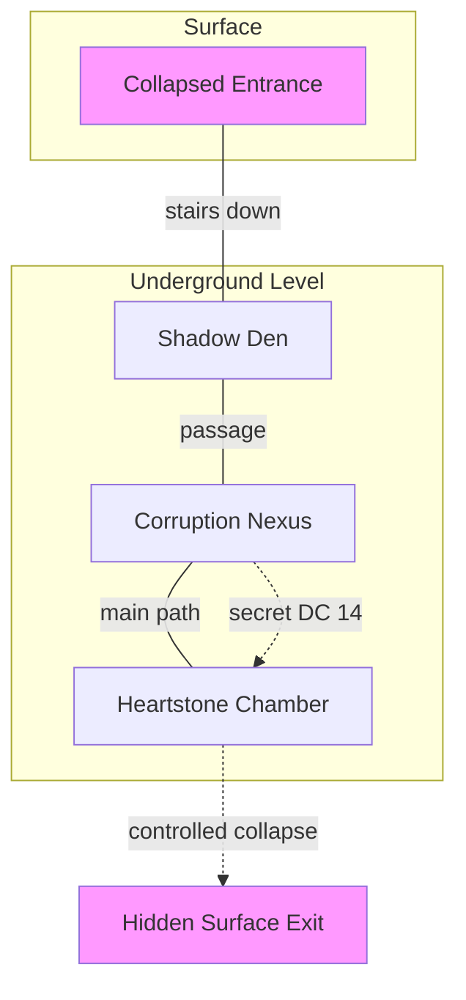

# Dungeon Format Template

**This template shows the correct structure for dungeon sections in session documents.**

---

## Dungeon Size Classification

- **Small:** 3-5 rooms
- **Medium:** 6-8 rooms
- **Large:** 9+ rooms

---

## Template Structure

```markdown
### Node X: Dungeon Name

**Size:** [Small/Medium/Large]

**Dungeon-Wide Mechanics:**
[Ask during creation: Is there a dungeon theme/mechanic that applies everywhere?]
- Examples: Shadow corruption drains resources, rising water timer, collapsing structure
- Leave blank if dungeon has no unified mechanic

**Map:**

```mermaid
[Insert appropriate size map showing Jaquaysing principles:
- Loops, not linear paths
- Vertical connections
- Multiple entrances/exits
- Secret passages
- No single chokepoints]
```

**Toggle: Corridors & Connections**

[List all corridors/passages between rooms with their properties]

- **Corridor A (connects Room 1 → Room 2)**
    - Length: [distance]
    - Features: [traps, features, hiding spots]
    - Width: [size restrictions]
    - Special: [anything notable]

- **Corridor B (connects Room 2 → Room 3)**
    - [same structure]

**Toggle: Design Questions** (Answer during dungeon creation):

> **Step 1: Choose Structure**
> - Start with loops, not lines
> - Add vertical elements
> - Create alternate paths
> - No single chokepoints

> **Step 2: Add Tactical Elements** (if combat-focused)
> - Size-restricted passages
> - Murder holes/firing ports
> - Trap triggers in rooms
> - Retreat routes planned

> **Step 3: Environmental Weapons**
> - What can burn?
> - What can flood?
> - What can collapse?
> - What can block?

> **Step 4: Escalation Path** (if intelligent defenders)
> - Initial defense plan
> - Fallback positions
> - Last stand location
> - Escape routes

---

**Toggle: Room 1 - [Room Name]**

**Toggle: Boxed Text**
> Description of what PCs immediately see when entering

**Toggle: Dungeon Turn Prompts**
[Situational, unbiased questions based on what PCs are doing]

Examples from book:
- "What's everyone else doing while [PC] does [action]?"
- "While [PC] is [doing thing], what are the rest of you up to?"
- "[PC] is doing [action]. What about [other PCs]?"

**Toggle: Creatures**
- **Creature Type 1 (X count)**
    - AC XX, HP XX
    - Attack: +X to hit, XdX+X damage type
    - Special: [Ability name and effect]
    - Tactics: [How they fight]
- **Creature Type 2 (X count)**
    - AC XX, HP XX
    - Attack: +X to hit, XdX+X damage type
    - Special: [Ability name and effect]
    - Tactics: [How they fight]

**Toggle: Turn Order**
- [ ] XX - [Creature name]
- [ ] XX - [Creature name]
- [ ] XX - [Creature name]
- [ ] XX - [Creature name]

**Toggle: Interactive Elements**
- **Element Name** ([DC if applicable])
    - Description and mechanical effect
    - How PCs can interact with it
- **Element Name** ([DC if applicable])
    - Description and mechanical effect
    - How PCs can interact with it

**Toggle: Room Tactics**
[Specific tactics/events for this room]
- How enemies use the space
- Environmental hazards
- Triggers or conditional events

---

**Toggle: Room 2 - [Room Name]**

[Same structure as Room 1]

---

**Toggle: Room 3 - [Room Name]**

[Same structure as Room 1]

---

[Continue for all rooms]

```

---

## Example: Shadow Dungeon (Small - 3 Rooms)

```markdown
### Node 2: Shadow Corruption Dungeon

**Size:** Small (3 rooms)

**Dungeon-Wide Mechanics:**
- Shadow corruption drains PC resources (spell slots, features, HP)
- All creatures regenerate from shadows unless light source present
- Darkness throughout (no natural light)

**Map:**



**Design Questions:**

> **Step 1: Structure**
> - Loop: Secret passage from R2 to R3 bypasses main combat
> - Vertical: Controlled collapse in R3 can create new exit
> - Multiple paths: Two ways to reach R3
> - No chokepoints: Can skip Room 2 combat entirely

> **Step 2: Tactical Elements**
> - Shadows use bonus action hide in objects
> - Small cracks in walls (size-restricted for shadow movement)
> - Retreat route: Shadows flee R1 → R2 if overwhelmed

> **Step 3: Environmental Weapons**
> - Burn: Corruption puddles detonate with fire (2d6, 10ft)
> - Collapse: Stone pillars and unstable rubble
> - Block: Toppling pillars creates terrain barriers

> **Step 4: Escalation**
> - Initial: R1 guards engage intruders
> - Fallback: Survivors flee to R2, alert larger shadows
> - Last Stand: R2 creatures guard path to R3
> - Escape: None (shadows dissolve when corruption source removed)

---

**Toggle: Corridors & Connections**

- **Entrance Passage (Surface → Room 1)**
    - Length: 30 feet, descending stairs
    - Features: Collapsed rubble, purple mist creeping up from below
    - Width: 5 feet (single file)
    - Special: Investigation DC 12 reveals corruption intensifies as you descend

- **Passage A (Room 1 → Room 2)**
    - Length: 20 feet
    - Features: Fissures leak purple mist, walls slick with residue
    - Width: 10 feet
    - Special: Air flows toward Room 2 (Investigation DC 12)

- **Secret Passage (Room 2 → Room 3)**
    - Length: 15 feet, behind corruption veil
    - Features: Investigation DC 14 to find, narrow squeeze
    - Width: 3 feet (tight)
    - Special: Bypasses main combat in Room 2

- **Main Passage (Room 2 → Room 3)**
    - Length: 25 feet
    - Features: Corruption veins visible in floor
    - Width: 10 feet
    - Special: None

---

**Toggle: Room 1 - Shadow Den**

**Toggle: Boxed Text**
> You emerge into a natural cave chamber, its ceiling studded with dripping stalactites. Purple mist clings to the uneven floor in pools. The corruption here is thick—you can taste metal in the air, feel the unnatural cold seeping through your clothes. In the dim purple glow, you see movement: dark shapes circling, watching.

**Toggle: Dungeon Turn Prompts**
[Adjust based on what PCs are actually doing]

- "What's everyone else doing while [PC] examines the mist?"
- "While [PC] moves forward, what are the rest of you up to?"
- "[PC] is searching the walls. What about the others?"

**Toggle: Creatures**
- **Medium Shadows (2)**
    - AC 14, HP 25
    - Attack: +5 to hit, 1d8+2 necrotic
    - Drain: WIS 14 save or steal buff/trait (THP → shield, offensive trait → AoE burst)
    - Tactics: Hide in objects, ambush with advantage
- **Weak Shadows (4)**
    - AC 12, HP 7
    - Attack: +4 to hit, 1d6+1 necrotic
    - Drain: WIS 14 save, weaker effect
    - Tactics: Swarm isolated targets, use pack tactics

**Turn Order:**
- [ ] 14 - Medium Shadow
- [ ] 14 - Medium Shadow
- [ ] 3 - Weak Shadow
- [ ] 3 - Weak Shadow
- [ ] 3 - Weak Shadow
- [ ] 3 - Weak Shadow

**Interactive Elements:**
- **Corruption Puddles** (Perception DC 12 to spot)
    - Purple liquid pools, difficult terrain
    - Detonate with fire: 2d6 damage, 10ft radius
- **Stone Columns** (3 available)
    - Provide full cover when standing
    - Athletics DC 15 to topple: 3d6 damage to target
- **Crates & Objects** (scattered)
    - Shadows hide here (bonus action)
    - Investigation DC 11 to spot hidden shadow
    - Can destroy to deny hiding spots
- **Wall Fissures** (Investigation DC 12)
    - Leak purple mist
    - Air flows toward Room 2 (navigation hint)

**Toggle: Room Tactics**
- Weak shadows swarm first, draw attention
- Medium shadows wait in hiding, ambush with advantage
- Focus isolated PCs or spellcasters
- If reduced to 1-2 creatures, flee to Room 2

---

**Toggle: Room 2 - Corruption Nexus**

**Toggle: Boxed Text**
> The passage descends into a larger cavern, and the wrongness hits you like a physical blow. Purple corruption doesn't just glow here—it *pulses*, rhythmic like a heartbeat. The walls are slick with shadow-residue. Pools of liquid darkness gather in floor depressions. Then the walls themselves begin to move. Two massive humanoid shapes peel away from the stone—shadows given form.

**Toggle: Dungeon Turn Prompts**
[Adjust based on what PCs are doing]

- "What's everyone else doing while [PC] searches the walls?"
- "While [PC] examines the pools, what are the others up to?"
- "[PC] is moving toward the next chamber. What about the rest of you?"

**Toggle: Creatures**
- **Large Shadows (2)**
    - AC 16, HP 40
    - Attack: +6 to hit, 2d8+3 necrotic
    - Drain: WIS 14 save or lose major resource (spell slot → heals shadow, class feature → forecasts AoE, THP → damage shield)
    - Tactics: Focus spellcasters, retreat to walls when bloodied, use darkness to hide

**Turn Order:**
- [ ] 12 - Large Shadow
- [ ] 12 - Large Shadow

**Interactive Elements:**
- **Stone Pillars** (3 available)
    - Full cover
    - Athletics DC 15 to topple: 3d6 damage
- **Corruption Pools** (4 scattered)
    - Feed shadows, difficult terrain
    - Destroy with radiant/fire: 1d6 damage to nearest shadow
- **Distortion Zones** (corruption warps space)
    - Arcana DC 13 to trigger
    - Effect: Shadow disadvantage on attacks for 1 round
- **Floor Cracks** (spiderweb pattern through center)
    - Running triggers DEX DC 11 or prone
- **Secret Passage** (Investigation DC 14)
    - Behind corruption veil on east wall
    - Leads directly to Room 3
    - Bypasses this combat entirely

**Toggle: Room Tactics**
- Shadows use darkness and pillars for cover
- Drain spell slots to heal themselves
- Retreat to walls when damaged
- Won't pursue far (guard this room)
- Alert: If Room 1 survivors fled here, shadows know party is coming

---

**Toggle: Room 3 - Heartstone Chamber**

**Toggle: Boxed Text**
> You emerge into unexpected stillness. The chamber is circular, almost peaceful compared to the chaos behind you. Purple light fills the space, emanating from a fist-sized crystal half-buried at the room's center. The Heartstone. It sits among ancient rubble, its fey energy creating hypnotic patterns in the air.

**Toggle: Dungeon Turn Prompts**
[Adjust based on what PCs are doing]

- "What's everyone else doing while [PC] examines the crystal?"
- "While [PC] checks the rubble, what are the others up to?"
- "[PC] is moving toward the Heartstone. What about everyone else?"

**Toggle: Creatures**
None (environmental/skill challenge room)

**Toggle: Interactive Elements**
- **The Heartstone** (Perception DC 12 or Investigation DC 10)
    - Fist-sized crystal, warm to touch
    - Partially buried in rubble
    - Requires action to extract safely
    - Detect Magic: Strong fey aura (transmutation)
- **Unstable Rubble Mound** (20x20 area, Perception DC 12 reveals danger)
    - Weight-triggered: STR save DC 11 or collapse
    - Collapse: 2d6 bludgeoning, difficult terrain 15ft
    - Athletics DC 14: Controlled collapse reveals hidden exit to surface
- **Corruption Veins** (purple energy lines through floor)
    - Arcana DC 14: Connected to giant's axe on surface
    - Touching: 1d4 psychic damage
- **Ancient Carvings** (fey symbols on walls, Religion/Arcana DC 14)
    - Translation: "Guardian heart preserves the bond"
    - Foreshadows Heartstone → axe connection

**Toggle: Room Tactics**
- Navigate unstable rubble without triggering collapse
- Identify safe paths (Perception DC 11)
- Extract Heartstone safely
- Optional: Controlled collapse for alternate exit

```

---

## Format Rules Summary

**✅ DO:**
- Classify dungeon size (Small/Medium/Large)
- Use Mermaid maps showing Jaquaysing principles
- Include dungeon-wide mechanics if applicable
- Use Notion toggle format: `**Toggle: Title**`
- Add "Corridors & Connections" toggle before rooms
- Make everything under a room collapsible (sub-toggles)
- Structure creatures with initiative checkboxes in separate toggle
- Use situational, unbiased dungeon turn prompts
- List interactive elements like creature stats
- Include room-specific tactics in separate toggle

**❌ DON'T:**
- Use HTML `<details>` tags
- Add bias to dungeon turn prompts (no "How are you approaching?")
- Create "During Combat" subsections
- Add summary statements like "encourage exploration"
- Use false metrics like "Rooms: 6" (use size classification)
- Mix creature types (keep continuity - shadows are shadows, not rats)
- Put content directly under room heading (use sub-toggles)

---

## MCP Integration Notes

When `session_flow` MCP creates dungeons:

1. Ask for dungeon size (Small/Medium/Large)
2. Ask for dungeon-wide mechanics (if any)
3. Generate appropriate Mermaid map template
4. Create room toggles with proper structure
5. Include turn order checkboxes for creatures
6. Format interactive elements like creature blocks
7. Use Notion-compatible markdown only

---

## See Also

- `.config/SESSION_FORMAT_SPEC.md` - Overall session format
- `Resources/Frameworks/SYWTBAGM_Framework.md` - Dungeon turn mechanics
- `.config/NOTION_ARCHITECTURE.md` - Notion sync requirements
