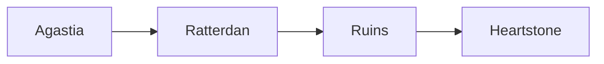

# Markdown Features Test

This file tests the new markdown-to-Notion features: tables, wikilinks, and improved formatting.

## Feature 1: Tables

### Simple Table

| NPC Name | Role | Location |
|----------|------|----------|
| Marcus   | Guide | Agastia |
| Sara     | Merchant | Ratterdan |
| Theron   | Wizard | Unknown |

### Table with Formatting

| **NPC** | **Class** | **Status** | **Notes** |
|---------|-----------|------------|-----------|
| *Manny* | Fighter   | Active     | `Main PC` |
| **Nikki** | Rogue   | Active     | Stealth expert |
| Rakash  | Barbarian | Active     | Goblin warrior |

### Table with Wikilinks (if pages exist)

| Character | Current Quest | Location |
|-----------|---------------|----------|
| [[PC_Manny]] | Find the artifact | [[Agastia]] |
| [[PC_Nikki]] | Steal documents | [[Ratterdan]] |
| [[PC_Ian_Rakash]] | Claim the axe | Ruins |

## Feature 2: Wikilinks

Wikilinks allow referencing other pages in the database.

### In Paragraphs

The party consists of [[PC_Manny]], [[PC_Nikki]], and [[PC_Ian_Rakash]]. They are currently investigating [[Location_Ratterdan]] at the request of [[NPC_Marcus]].

### In Lists

- [[PC_Manny]] - Fighter investigating ruins
- [[PC_Nikki]] - Rogue on stealth mission
- [[Professor Zero]] - Quest giver
- [[The Patron]] - Mysterious benefactor

### In Headings

#### Quest: [[PC_Nikki]]'s Temporal Bloodline

The temporal bloodline quest involves [[Nikki]] and the [[Decimate Project]].

## Feature 3: Toggles (Details Tags)

<details>
<summary><b>Combat Encounter</b></summary>

**Enemies:**
- 3x Bandits (AC 12, HP 11)
- 1x Bandit Captain (AC 14, HP 32)

**Tactics:**
- Captain stays back and commands
- Bandits flank if possible
- Retreat at 25% HP

**Loot:**
- 45 gold pieces
- 1x Short sword +1
- Map to hidden cache

</details>

<details>
<summary>Session Notes</summary>

- Party arrived in Ratterdan
- Met with Marcus
- Discovered ruins entrance
- Encountered shadow creatures
- Found ancient artifact fragment

</details>

## Feature 4: Mixed Content

### Quest: Find the Heartstone Fragment

**Overview:**
[[Professor Zero]] has tasked the party with recovering a fragment of the ancient Heartstone from the ruins of [[Ratterdan]].

**Party Members:**
| Character | Role | Motivation |
|-----------|------|------------|
| [[PC_Manny]] | Tank | Protect the group |
| [[PC_Nikki]] | Scout | Find treasure |
| [[PC_Ian_Rakash]] | Damage | Prove strength |

<details>
<summary>Quest Details</summary>

**Objectives:**
1. Travel to [[Ratterdan]]
2. Navigate the ruins
3. Defeat the guardian
4. Retrieve the fragment
5. Return to [[Professor Zero]]

**Rewards:**
- 500 gold per party member
- Magic item of choice (uncommon)
- Favor from [[The Patron]]

</details>

**Related NPCs:**
- [[Professor Zero]] - Quest giver
- [[NPC_Marcus]] - Local guide
- [[Steel Dragon]] - Mentioned in prophecy

## Feature 5: Code Blocks

Still work as before:

```python
def calculate_damage(base, modifier):
    return base + modifier
```



## Expected Results

When synced to Notion:

✅ Tables render as native Notion tables
✅ Wikilinks become clickable page mentions (if pages exist)
✅ Wikilinks show as styled code if pages don't exist: `[[NonExistent]]`
✅ Toggles become collapsible Notion toggle blocks
✅ Formatting (bold, italic, code) preserved everywhere
✅ Code blocks render correctly

---

**Test Status:** Ready to sync
**Database:** D&D Campaign Entities
**Date:** 2025-12-28
