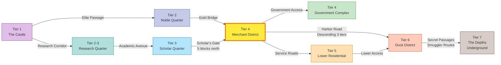
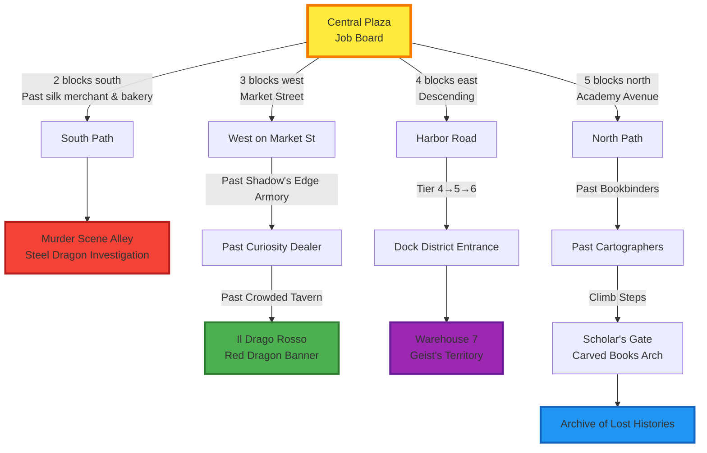

# Agastia City Map (Mermaid Diagram)

## Complete City Map - All Tiers and Districts

```mermaid
graph TD
    %% Tier 1 - The Castle
    InverseTower[Inverse Tower<br/>Tier 1: The Castle]
    HallAscension[Hall of Ascension]
    SpireGardens[Spire Gardens]

    InverseTower --> HallAscension
    InverseTower --> SpireGardens

    %% Tier 2 - Noble Quarter
    SkyviewEstates[Skyview Estates<br/>Tier 2: Noble Quarter]
    AzureTerrace[Azure Terrace]
    StarfallGardens[Starfall Gardens]
    ConcordanceHall[Concordance Hall]
    VelvetCoin[Velvet Coin Banking]
    HouseMoonwhisper[House Moonwhisper]

    SkyviewEstates --> AzureTerrace
    SkyviewEstates --> StarfallGardens
    SkyviewEstates --> HouseMoonwhisper
    AzureTerrace --> ConcordanceHall
    AzureTerrace --> VelvetCoin
    StarfallGardens --> ConcordanceHall

    %% Tier 2-3 - Research Quarter
    BladesGlory[Blades of Glory<br/>Tier 2-3: Research Quarter]
    AugurySpire[Augury Spire]
    GrandCathedral[Grand Cathedral]
    ResonanceLibrary[Resonance Library]
    MagewrightConsortium[Magewright Consortium]

    BladesGlory --> AugurySpire
    AugurySpire --> GrandCathedral
    GrandCathedral --> ResonanceLibrary
    GrandCathedral --> MagewrightConsortium

    %% Tier 3 - Scholar Quarter
    GrandAcademy[Grand Academy<br/>Tier 3: Scholar Quarter]
    ArchiveLostHistories[Archive of Lost Histories]
    MeritTestingCenters[Merit Testing Centers]
    InfiniteTheorem[Infinite Theorem Cafe]
    InkwellQuill[Inkwell & Quill]

    GrandAcademy --> ArchiveLostHistories
    GrandAcademy --> MeritTestingCenters
    GrandAcademy --> InkwellQuill
    ArchiveLostHistories --> InfiniteTheorem

    %% Tier 4 - Merchant District
    CentralPlaza[Central Plaza Job Board<br/>Tier 4: Merchant District]
    MurderSceneAlley[Murder Scene Alley]
    IlDragoRosso[Il Drago Rosso Restaurant]
    TheExchange[The Exchange Marketplace]
    BrightcoinSupplies[Brightcoin Emergency Supplies]
    WanderersPack[Wanderer's Pack]
    GildedScale[Gilded Scale Guild]
    PublicTemple[Public Temple]

    CentralPlaza -->|2 blocks south| MurderSceneAlley
    CentralPlaza -->|3 blocks west| IlDragoRosso
    CentralPlaza --> TheExchange
    TheExchange --> BrightcoinSupplies
    TheExchange --> WanderersPack
    TheExchange --> GildedScale
    IlDragoRosso --> PublicTemple

    %% Tier 4 - Government Complex
    GovInverseTower[Inverse Tower Public Levels<br/>Tier 4: Government Complex]
    CouncilChamber[Council Chamber<br/>Below Ground]
    MeritRegistry[Merit Registry<br/>Below Ground]
    TestingHalls[Testing Halls<br/>Below Ground]
    DeptInvestigation[Dept of Investigation<br/>Below Ground]
    PetitionersPlaza[Petitioner's Plaza]

    GovInverseTower --> PetitionersPlaza
    GovInverseTower --> CouncilChamber
    GovInverseTower --> MeritRegistry
    GovInverseTower --> TestingHalls
    GovInverseTower --> DeptInvestigation

    %% Tier 5 - Lower Residential
    CopperMug[Copper Mug Tavern<br/>Tier 5: Lower Residential]
    StonewickHerbalist[Stonewick Herbalist]
    WorkingClassArmory[Working Class Armory]
    IronhandRepairs[Ironhand Repairs]
    ThreadbareTailoring[Threadbare Tailoring]
    DailyBoard[Daily Board]

    CopperMug --> StonewickHerbalist
    CopperMug --> WorkingClassArmory
    CopperMug --> IronhandRepairs
    CopperMug --> ThreadbareTailoring
    CopperMug --> DailyBoard

    %% Tier 6 - Dock District
    RustyAnchor[Rusty Anchor Tavern<br/>Tier 6: Dock District]
    SaltwindSupply[Saltwind General Supply]
    TidecallerArmory[Tidecaller Armory]
    SawbonesSurgery[Sawbones Surgery]
    ManifestOffice[Manifest Office]
    Warehouse7[Warehouse 7<br/>Geist's Hub]

    RustyAnchor --> SaltwindSupply
    RustyAnchor --> TidecallerArmory
    RustyAnchor --> SawbonesSurgery
    RustyAnchor --> Warehouse7
    SaltwindSupply --> ManifestOffice

    %% Tier 7 - The Depths
    HiddenDoor[Hidden Door Inn<br/>Tier 7: The Depths Underground]
    UndergroundMarket[Underground Market]
    ShadowsEdgeArmory[Shadow's Edge Armory]
    DesperatesRefuge[Desperate's Refuge]
    GatheringStone[Gathering Stone]

    HiddenDoor --> UndergroundMarket
    HiddenDoor --> GatheringStone
    UndergroundMarket --> ShadowsEdgeArmory
    ShadowsEdgeArmory --> GatheringStone
    HiddenDoor --> DesperatesRefuge

    %% Inter-District Connections
    InverseTower -.->|Elite Access| SkyviewEstates
    SkyviewEstates -.->|Gold Bridge| CentralPlaza
    GrandAcademy -.->|Scholar's Gate| CentralPlaza
    CentralPlaza -.->|Harbor Road Descent| RustyAnchor
    CentralPlaza -.->|Service Tunnels| CopperMug
    CopperMug -.->|Lower Access| RustyAnchor
    RustyAnchor -.->|Secret Passages| HiddenDoor

    %% Session 3 Critical Path (Highlighted)
    CentralPlaza -.->|Session 3 Start| MurderSceneAlley
    CentralPlaza -.->|Nikki's Hook| IlDragoRosso
    CentralPlaza -.->|Manny's Hook| ArchiveLostHistories
    CentralPlaza -.->|Kyle's Hook| Warehouse7

    style CentralPlaza fill:#ffeb3b,stroke:#f57c00,stroke-width:4px
    style MurderSceneAlley fill:#f44336,stroke:#b71c1c,stroke-width:3px
    style IlDragoRosso fill:#4caf50,stroke:#2e7d32,stroke-width:3px
    style ArchiveLostHistories fill:#2196f3,stroke:#1565c0,stroke-width:3px
    style Warehouse7 fill:#9c27b0,stroke:#6a1b9a,stroke-width:3px
```

## District-Level Navigation Map

## Session 3 Navigation Focus - Merchant District Detail

## Cardinal Direction Verification

### North-South Axis (Vertical)
- **North:** Scholar Quarter → Merchant District (5 blocks south)
- **South:** Merchant District → Murder Scene Alley (2 blocks south)

### East-West Axis (Horizontal)
- **West:** Job Board → Il Drago Rosso (3 blocks west on Market St)
- **East:** Job Board → Dock District (4 blocks east, descending)

### Vertical Tier System
- **Ascending:** Tier 7 (Underground) → Tier 6 (Docks) → Tier 5 (Lower Res) → Tier 4 (Merchant/Gov) → Tier 3 (Scholar) → Tier 2 (Noble/Research) → Tier 1 (Castle)
- **Descending:** Opposite direction

### Cross-Tier Connections
1. **Gold Bridge:** Noble Quarter (T2) ↔ Merchant District (T4)
2. **Scholar's Gate:** Scholar Quarter (T3) ↔ Merchant District (T4)
3. **Harbor Road:** Merchant District (T4) → Dock District (T6) via 3-tier descent
4. **Service Tunnels:** Merchant District (T4) → Lower Residential (T5)
5. **Secret Passages:** Dock District (T6) → The Depths (T7)

## Map Legend

**Node Types:**
- Yellow/Orange (Central Plaza): Primary session hub
- Red (Murder Scene): Steel Dragon investigation
- Green (Il Drago Rosso): Nikki's family hook
- Blue (Archive): Manny's Codex quest
- Purple (Warehouse 7): Kyle's Geist hunt

**Connection Types:**
- Solid lines (—): Direct within-district connections
- Dashed lines (-.->): Inter-district connections
- Labeled edges: Cardinal direction + distance/description

## Usage in Session 3

**When players ask "What do we see?":**
1. Use appropriate map section based on current location
2. Describe visible connection options (cardinal directions)
3. Add sensory details from connection labels

**When players move between locations:**
1. Follow the edge path in the diagram
2. Read connection label (distance, landmarks)
3. Use navigation descriptions from Session 3 file

**When players get lost:**
1. Return to nearest major hub (Central Plaza, district taverns)
2. Re-orient using district-level map
3. Provide cardinal direction to destination
