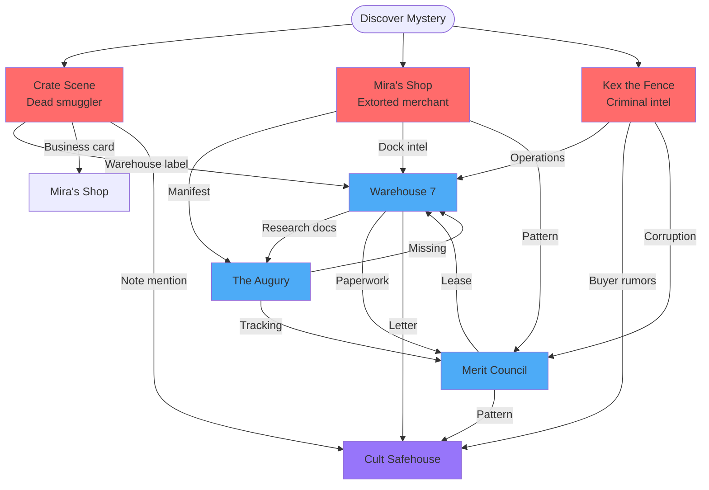

# Quest: [[Geist]] Investigation - The Starfall Anchor Heist

## Player Summary

[[Kyle/Nameless]] seeks to investigate Inspector [[Geist]], a corrupt Merit Council official running a smuggling operation in [[Agastia]]'s [[Dock District]]. The investigation will reveal that [[Geist]] is working with dock clerk Harren Dockwise and Dock Superintendent [[Kaelborn]] to intercept valuable shipments. Their latest heist: six Starfall Anchors stolen from The Augury's confidential research project—artifacts now in the hands of the [[Chaos Cult]].

### Quest Type: 3-3-3-1 Mystery Investigation

**Structure:**
- **3 Entry Points:** Multiple ways to discover the conspiracy
- **7 Investigation Locations:** Interconnected web of clues
- **5 Revelations:** Core truths to uncover (each with 3+ clues)
- **1 Conclusion:** All paths converge to expose the conspiracy

**Depth:** 2-3 successful leads to reach confrontation

---

## THE SITUATION (DM Eyes Only)

### What Actually Happened

**The Legitimate Shipment (5 Days Ago):**
- **The Augury** (Agastia's arcane research institution) commissioned 6 Starfall Anchors from Lord Zaos's Feywild vault
- **Purpose:** Project Threshold - defensive ward research using planar barrier artifacts
- **Confidential:** Merit Council classified shipment ("Research Materials - Class 7")
- **Value:** 30,000 gp research grant + diplomatic significance
- Shipment arrived at docks 5 days ago aboard _Moonwhisper_

**The Heist:**
1. Dock clerk **Harren Dockwise** (Geist's informant) tips Geist about valuable confidential cargo
2. Harren "misroutes" shipment to Warehouse 7, marks official records "damaged in transit - disposed"
3. **Geist's thugs** (not Geist personally) collect cargo from Warehouse 7, unbox it
4. Thugs find research papers, report to Geist
5. Geist contacts buyer: **"The Architect"** (Chaos Cult contact)
6. **4 Starfall Anchors** delivered to Chaos Cult safehouse (20,000 gp payment)
7. **Final 2 anchors** prepared for secondary buyer OR completing Cult's order
8. Smuggler transporting final 2 dies on road to Agastia (CRATE SCENE - Session 3 Day 1)

**The Conspiracy:**
- **Harren Dockwise** (Dock Clerk) - 10% cut (2,000 gp)
- **Inspector Geist** (Corrupt Inspector) - 50% cut (10,000 gp)
- **Kaelborn** (Dock Superintendent, Tier 5) - 40% cut (8,000 gp)

**Why It Works:**
- Looks like shipping error, not theft
- Geist never touches cargo (plausible deniability)
- Kaelborn blocks deeper investigations
- Victim (Augury) can't publicly complain about stolen secret artifacts
- Castle can't override Kaelborn without hard evidence

### The Starfall Anchors (What Players Learn)

**What They Are:**
- Feywild crystalline artifacts (18-inch pylons, purple cores, silver veins)
- Used to stabilize planar barriers between Material Plane and Feywild
- Extremely rare - Lord Zaos guards his vault carefully
- Research materials for defensive ward improvements

**Why They Matter:**
- **Augury:** Needs them for critical Project Threshold research
- **Chaos Cult:** Plans to use them for dimensional corruption ritual (weaken barriers, spread shadow)
- **Lord Zaos:** Diplomatic loan from his personal vault - demands return
- **Kyle:** Patron Lord Zaos involved (personal stakes)

**Current Status:**
- 4 anchors in Chaos Cult hands (Phase 1 of ritual started)
- 2 anchors missing (smuggler died during transport)
- Cult needs all 6 to complete Phase 2 (dimensional breach)

---

## THE REVELATIONS (What PCs Must Discover)

### REVELATION 1: Starfall Anchors are valuable Feywild research artifacts

**Why this matters:** PCs need to know WHAT was stolen and WHY it's important

**Clue 1A (Warehouse 7) - Research proposal:**
- Partial document: "Project Threshold - Defensive Ward Enhancement Study"
- Describes "six crystalline samples from Feywild source" for ward improvements
- Budget: 30,000 gp Merit Council research grant
- Doesn't name "Starfall Anchors" directly (confidential language)

**Clue 1B (Mira Saltwind) - Shipping manifest fragment:**
- Lists cargo: "Research Materials - Class 7 Restricted, 6 units"
- Consignee: The Augury, Scholar Quarter
- Shipper: Lord Zaos Yllalar, Feywild Court
- Purpose: Arcane Research Division

**Clue 1C (The Augury) - Researcher testimony:**
- Initially cautious (confidential project)
- If trust earned: "We commissioned sensitive Feywild research materials for Project Threshold."
- "Six irreplaceable crystalline artifacts for planar barrier stabilization study."
- "Lord Zaos doesn't loan vault items lightly. If not recovered, diplomatic catastrophe."

**Clue 1D (Kex the Fence) - Black market assessment:**
- "Feywild artifacts worth fortune on black market."
- "Planar research tools especially valuable. Every faction wants them."
- "30,000 gold legitimate, double that illegal."

**Clue 1E (Crate Scene) - Feywild packing materials:**
- Moonpetal Moss (Feywild preservative)
- Silk wrapping glowing with magic
- Professional packing (official shipment, not criminal)

**Clue 1F (Augury) - Technical documentation:**
- Research notes (if PCs gain access): "Feywild artifacts used to stabilize dimensional boundaries"
- "Extremely rare. Vault-guarded. If removed from position, can destabilize planar barriers."

### REVELATION 2: Geist's organization intercepted the shipment via dock clerk

**Why this matters:** PCs need to know WHO committed the crime

**Clue 2A (Dock Records) - Misrouting "error":**
- Shipping log: "Shipment #7742 - Damaged in transit, disposed per protocol"
- Clerk's handwriting: "Rerouted to W7 for inspection - authority: Inspector Geist"
- Dated 5 days ago, signed: Harren Dockwise

**Clue 2B (Warehouse 7) - Thug evidence:**
- Cheap ale bottles, dice, playing cards (thugs waiting, not inspectors)
- Crowbar with Feywild silk threads (opened crate)
- NO official inspection records or Geist's personal effects

**Clue 2C (Mira Saltwind) - Pattern testimony:**
- "Valuable shipments go 'missing' at docks all the time."
- "Official story: shipping error or damaged cargo."
- "I've seen Geist's people collecting from Warehouse 7. It's not an error."

**Clue 2D (Dock Worker Witness) - Saw thugs:**
- "Saw rough types loading crate from W7. Not inspectors. Didn't ask questions."

**Clue 2E (The Augury) - Geist's fake investigation:**
- "We filed complaint. Inspector Geist assigned."
- "He reported: shipping error, no evidence of theft."
- "Closed case in ONE day. Didn't even question us."

**Clue 2F (Crate Scene) - Shadow burns on body:**
- Death not from robbery (valuables untouched)
- Magical burns (planar/dimensional magic)
- Suggests dangerous cargo OR targeted killing

### REVELATION 3: Warehouse 7 is Geist's distribution hub

**Why this matters:** PCs need to know WHERE to investigate

**Clue 3A (Crate Scene) - Warehouse origin label:**
- Stenciled: "W7-DD-B3" (Warehouse 7, Dock District, Bay 3)
- Not standard shipping label (internal warehouse code)
- Indicates crate STORED there, then moved

**Clue 3B (Dock Worker Witness) - Thug activity:**
- "Rough types going in/out of W7 past few days."
- "Not dock workers, not inspectors. Hired muscle."
- "Loaded fancy crate with Feywild shimmer four days ago."

**Clue 3C (Kex the Fence) - Criminal knowledge:**
- "Geist never touches goods himself. Too smart."
- "Has crew that handles physical work. Warehouse 7 is their hub."
- "By the time cargo is 'lost,' it's already sold."

**Clue 3D (Mira Saltwind) - Dock intel:**
- "Contact at docks saw Geist's people move glowing crate to Warehouse 7."
- "Five days ago. Feywild markings."

**Clue 3E (Warehouse 7) - Physical evidence:**
- Broken crate with Feywild markings
- Moonpetal Moss on floor
- Six anchor-shaped indentations in packing (all removed)

### REVELATION 4: Harren + Geist + Kaelborn conspiracy

**Why this matters:** PCs need to know the conspiracy goes higher

**Clue 4A (Dock Records) - Harren's pattern:**
- Multiple shipments "lost/damaged" (47 in past year)
- All signed: Harren Dockwise
- All valuable cargo
- Suspiciously high error rate for one clerk

**Clue 4B (Warehouse 7) - Payment ledger:**
- Coded entries: "H: 10%, G: 50%, K: 40%"
- Recent: "Architect deal - H: 2,000 / G: 10,000 / K: 8,000"
- Pattern of previous deals together

**Clue 4C (Merit Council Records) - Kaelborn blocks investigations:**
- 47 complaints about missing cargo
- 37 assigned to Geist: 100% ruled "shipping error"
- All approved/closed by: Dock Superintendent Kaelborn
- Castle can't override without hard evidence

**Clue 4D (Kex the Fence) - Criminal perspective:**
- "Geist couldn't operate without protection from above."
- "Kaelborn is dirty. Everyone knows."
- "Split profits. Geist gets goods, Kaelborn provides cover."

**Clue 4E (Merit Council Records) - Financial records:**
- Geist and Kaelborn: unexplained income spikes
- Timing correlates with major "lost shipments"
- Both banking at same branch

**Clue 4F (Mira Saltwind) - Corruption pattern:**
- Ledger of lost shipments
- All "detained by Geist, approved by Kaelborn"
- None returned to owners

### REVELATION 5: Anchors sold to Chaos Cult ("The Architect")

**Why this matters:** PCs need to know WHERE anchors went and WHAT's at stake

**Clue 5A (Warehouse 7) - Buyer correspondence:**
- Letter: "The Architect requires all six crystalline units. 20,000 for four now, 10,000 for final two upon delivery."
- Chaos Cult spiral symbol hidden in corner (Investigation DC 15)
- Delivery address: [Cult safehouse location]

**Clue 5B (Kex the Fence) - Underworld rumors:**
- "Someone called 'The Architect' bought expensive Feywild artifacts."
- "Chaos Cult whispers follow that name."
- "Paid 20,000 gold. Four items. Dimensional magic planned."

**Clue 5C (Crate Scene) - Smuggler's note:**
- In pocket: "Final delivery - 2 anchors to Saltwind Imports by midnight. The Architect wants all six. -H"
- Reveals: 2 anchors only, buyer name, urgency, "H" initial

**Clue 5D (Chaos Cult Safehouse) - Four anchors present:**
- Physical evidence: Four Starfall Anchors in ritual circle
- Dimensional corruption symbols inscribed
- Anchors glowing (active, not dormant)

**Clue 5E (Chaos Cult Safehouse) - Ritual notes:**
- "Four anchors create planar weakness for Phase 1"
- "Final two complete dimensional breach"
- "Barrier collapse enables shadow corruption spread citywide"

---

## INVESTIGATION LOCATIONS (Where to Find Clues)

### Entry Point 1: The Crate Scene (Road to Agastia)

**When:** Session 3 Day 1, party traveling to Agastia
**What:** Overturned cart, dead smuggler with shadow burns, damaged crate with Feywild debris

**Available Clues:**
1. **Warehouse 7 label** → LEAD to Warehouse 7
2. **Feywild packing materials** → REVELATION 1 (expensive Feywild artifacts)
3. **Smuggler's note** → REVELATION 5 (The Architect, Saltwind Imports)
4. **Business card** → LEAD to Mira Saltwind
5. **Shadow burns on body** → REVELATION 2 (dangerous cargo OR targeted killing)

**DM Notes:**
- Multiple leads prevent railroading
- Death cause intentionally ambiguous (Cult? Artifact? Monster?)
- Kyle's Lord Zaos connection revealed later

---

### Entry Point 2: Mira Saltwind's Shop (Merchant District)

**When:** After arriving in Agastia
**What:** Nervous merchant being extorted by Geist, has documentary evidence

**Available Clues:**
1. **Extortion testimony** → REVELATION 2 (Geist's pattern)
2. **Shipping manifest** → REVELATION 1 (what anchors are)
3. **Research connection** → LEAD to The Augury
4. **Dock worker intel** → LEAD to Warehouse 7
5. **Corruption pattern ledger** → REVELATION 4 (Geist+Kaelborn)

**DM Notes:**
- Mira willing to help if party seems competent
- Has been victimized by Geist for months
- Dock worker contact provides inside information

---

### Entry Point 3: Kex the Fence (The Depths - Underground Market)

**When:** After arriving in Agastia
**What:** Criminal fence with underworld connections

**Available Clues:**
1. **Underworld rumors** → REVELATION 5 (Chaos Cult buyer)
2. **Criminal perspective** → REVELATION 4 (Kaelborn protection)
3. **Operational intel** → LEAD to Warehouse 7
4. **Black market value** → REVELATION 1 (artifact worth)
5. **Buyer location hint** → LEAD to Chaos Cult safehouse

**DM Notes:**
- Kex requires payment OR favor for information
- Knows criminal side, not official side
- Can point to Cult if party earns trust

---

### Investigation Site 1: Warehouse 7 (Dock District)

**What:** Unboxing site, evidence cache, central hub

**Available Clues:**
1. **Research proposal** → REVELATION 1 (Project Threshold)
2. **Thug evidence** → REVELATION 2 (Geist uses thugs)
3. **Physical unboxing debris** → REVELATION 3 (this is the hub)
4. **Payment ledger** → REVELATION 4 (H/G/K split)
5. **Buyer correspondence** → REVELATION 5 (Chaos Cult letter)

**DM Notes:**
- May be guarded (2-4 thugs)
- Breaking in = crime (stealth OR social approach)
- Most evidence-rich location

---

### Investigation Site 2: The Augury (Scholar Quarter)

**What:** Legitimate buyer, frustrated researchers, technical expertise

**Available Clues:**
1. **Researcher testimony** → REVELATION 1 (Project Threshold details)
2. **Technical documentation** → REVELATION 1 (anchor properties)
3. **Shipping tracking** → LEAD to Dock District
4. **Geist's fake investigation** → REVELATION 2 (closed case too fast)
5. **Lord Zaos urgency** → Kyle connection + stakes

**DM Notes:**
- Researchers initially cautious (confidential project)
- Will open up if party shows evidence or earns trust
- Can provide technical expertise on anchors

---

### Investigation Site 3: Merit Council Records Office (Tier 4)

**What:** Official documentation, pattern of corruption

**Available Clues:**
1. **Missing detention order** → REVELATION 2 (no official record)
2. **Harren's pattern** → REVELATION 4 (47 "errors")
3. **Kaelborn blocks investigations** → REVELATION 4 (100% closure rate)
4. **Warehouse 7 lease** → LEAD to Warehouse 7
5. **Financial records** → REVELATION 4 (unexplained income)

**DM Notes:**
- Requires official access OR stealth
- Bureaucrat may help if convinced of corruption
- Shows system working as designed (protecting itself)

---

### Investigation Site 4: Chaos Cult Safehouse (Location TBD)

**What:** Four anchors, ritual in progress, The Architect

**Available Clues:**
1. **Four anchors present** → REVELATION 5 (Cult has them)
2. **Ritual notes** → REVELATION 5 (what Cult plans)
3. **Cult-Kaelborn letters** → REVELATION 4 ("K" connection)
4. **Timing urgency** → Stakes (Phase 2 soon)
5. **Threat maps** → REVELATION 5 (citywide corruption)

**DM Notes:**
- Heavily guarded OR requires stealth
- Confrontation likely
- Finding this = major breakthrough

---

## CLUE FLOW DIAGRAMS

### Entry Points → Investigation Network

### Example Investigation Paths (2-3 Leads)

**Path A (Fast - 2 leads):**
Crate → Warehouse 7 → Chaos Cult Safehouse
*Revelations: R1, R2, R3, R4, R5 (all discovered)*

**Path B (Thorough - 3 leads):**
Mira → Augury → Merit Council → Warehouse 7
*Revelations: R1, R2, R4 (strong evidence against conspiracy)*

**Path C (Underworld - 3 leads):**
Kex → Warehouse 7 → Merit Council → Cult
*Revelations: R1, R4, R5 (political + cult evidence)*

---

## PROACTIVE CLUES (Failsafes if Players Stuck)

**If party gets stuck with no clear lead:**

### Failsafe 1: Geist's Thugs Attack
**Trigger:** Party asking too many questions
**Event:** 4 thugs ambush party to eliminate witnesses
**Clue:** Thug carries matchbook from Warehouse 7 OR orders from "H" (Harren)

### Failsafe 2: Second Smuggler Death
**Trigger:** Cult impatient for final 2 anchors
**Event:** Another smuggler found dead (similar shadow burns)
**Clue:** Cult safehouse address in victim's pocket

### Failsafe 3: Augury Publicly Complains
**Trigger:** Augury loses patience with Merit Council
**Event:** Researcher publicly demands investigation
**Clue:** Castle hires party as independent investigators

### Failsafe 4: Lord Zaos Contacts Kyle
**Trigger:** Zaos learns about stolen anchors
**Event:** Feywild messenger demands Kyle investigate
**Clue:** Kyle's patron grants access to Augury researchers

---

## CONFRONTATION OPTIONS

### Option A: Expose Geist Only (Easier)

**Approach:**
- Gather evidence against Geist's operation
- Present to Merit Council OR Castle
- Raid Warehouse 7

**Combat:** Geist + 6 thugs (CR 3-4 encounter)

**Outcome:**
- Geist arrested/killed
- Kaelborn cuts ties publicly, survives
- Harren scapegoated
- Chaos Cult keeps 4 anchors (incomplete ritual)

**Rewards:**
- 200 gp (confiscated goods + bounty)
- +Merit with Council
- Merchant gratitude (10% discounts)

---

### Option B: Expose Full Conspiracy (Harder)

**Approach:**
- Gather ironclad evidence against all three (H+G+K)
- Navigate Merit Council politics
- Prove Tier 5 official (Kaelborn) corrupt

**Requirements:**
- Payment ledger showing H/G/K split
- Witness testimony (Mira, dock workers)
- Official records showing pattern
- Chaos Cult connection

**Outcome:**
- All three arrested/removed
- Dock District power vacuum
- Merit Council credibility crisis
- Party gains powerful allies AND enemies

**Rewards:**
- 500+ gp (major bounty + political reward)
- ++Merit with Council
- Celebrity status in Merchant District
- Potential Council patronage

---

### Option C: Recover Anchors from Chaos Cult (Combat-Heavy)

**Approach:**
- Track Cult safehouse
- Raid to recover 4 anchors
- Combat-focused resolution

**Combat:** The Architect + 6 Cult Initiates + Shadow creatures (CR 5-6 encounter)

**Outcome:**
- 4 anchors recovered
- Cult Phase 2 prevented
- Geist/Kaelborn operation may continue
- Lord Zaos gratitude (Kyle's standing improved)

**Rewards:**
- Lord Zaos favor (Feywild boon)
- Augury gratitude (restricted archive access)
- Prevented dimensional catastrophe
- 2 anchors still missing

---

### Option D: Complete Resolution (Ambitious)

**Approach:**
- Expose conspiracy (Option B)
- Recover anchors (Option C)
- Return all 6 to Augury/Lord Zaos

**Requirements:**
- All of the above
- Likely multiple sessions
- High-risk, high-reward

**Outcome:**
- Full conspiracy dismantled
- All anchors recovered
- Project Threshold can proceed
- Maximum rewards from all factions

**Rewards:**
- 750+ gp
- +++Merit
- Lord Zaos major boon
- Augury research partnership
- Council reformation (long-term impact)

---

## CONSEQUENCES & FUTURE HOOKS

### If Geist Escapes:
- Retaliates against witnesses (Mira in danger)
- Flees to Kaelborn for protection
- Operation moves to new location

### If Kaelborn Survives:
- Publicly cuts ties with Geist
- Claims ignorance
- Continues operation covertly
- Recruits new lieutenant

### If Chaos Cult Keeps Anchors:
- Phase 2 ritual proceeds
- Dimensional breach in Dock District
- Shadow corruption spreads
- Future campaign threat

### If Anchors Returned:
- Augury completes Project Threshold
- Agastia's wards improved
- Lord Zaos diplomatic relations strengthened
- Kyle gains Zaos's favor

### Political Impact:
- Dock District power vacuum
- Other factions move in
- Merit Council credibility tested
- Castle oversight increased

---

## DM NOTES

### Mystery Design Philosophy

**3-3-3-1 Structure:**
- 3 entry points (multiple approaches)
- 7 investigation locations (interconnected web)
- 5 revelations (each with 3+ clues)
- 1 conclusion (all paths converge)

**Flexibility:**
- Players choose investigation order
- 2-3 leads to confrontation
- Multiple solution paths
- Can stop at Geist OR pursue full conspiracy

**Clue Redundancy:**
- Each revelation has 3-6 clues (backups for player failure)
- Clues reinforce suspicions (desirable)
- No single clue required (prevents stuck points)

**No Difficulty Scaling:**
- Mystery stays same regardless of level
- Players choose approach complexity
- Multiple solutions all valid

### Session Integration

**Session 3 Connection:**
- Day 1: Crate scene introduces mystery
- Arrival: Multiple entry points available
- Investigation: Pursue Geist OR other hooks
- Flexible pacing (1-2 sessions to resolve)

**Parallel Quests:**
- Steel Dragon investigation may overlap
- Merit Council politics affect all quests
- Dock District remains important location

### Key NPCs

**Harren Dockwise (Dock Clerk):**
- Nervous, greedy, in over his head
- Will flip if cornered (gives up Geist)
- 10% cut = 2,000 gp (huge for clerk)

**Inspector Geist (Corrupt Inspector):**
- Never appears in person (thugs handle work)
- Plausible deniability expert
- Arrogant, believes untouchable

**Kaelborn (Dock Superintendent):**
- Tier 5 official, politically connected
- Calm, calculated, dangerous
- Won't go down without fight

**The Architect (Chaos Cult Contact):**
- Mysterious, never met in person
- Dimensional corruption specialist
- Needs all 6 anchors for ritual

**Mira Saltwind (Merchant):**
- Extortion victim, potential ally
- Documentary evidence keeper
- Brave but scared

**Kex the Fence (Criminal):**
- Knows underworld side
- Requires payment/favor
- Pragmatic, not loyal to anyone

### Treasure & Rewards

**From Warehouse 7:**
- 500 gp in confiscated goods
- Incriminating ledgers (evidence)
- Research papers (clues)

**From Chaos Cult:**
- 4 Starfall Anchors (if recovered)
- Ritual components (sellable)
- Cult intelligence (future hooks)

**From Factions:**
- Augury: Archive access, research partnership
- Lord Zaos: Feywild favor, diplomatic credit
- Merit Council: ++Merit, potential patronage
- Merchants: Discounts, trade network access
