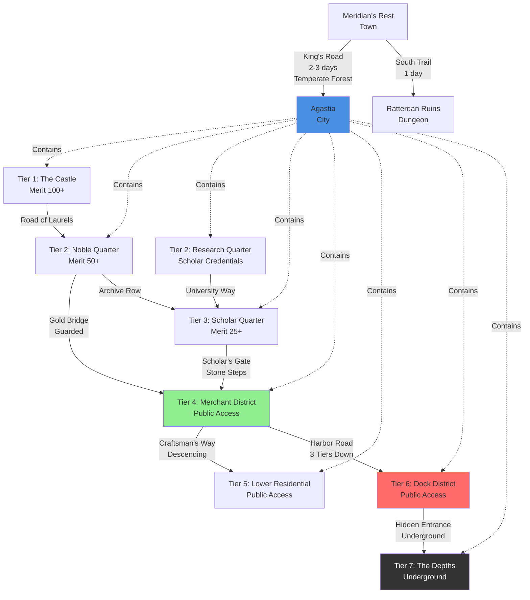
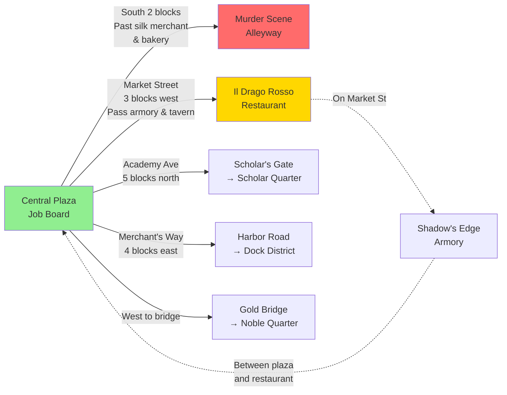
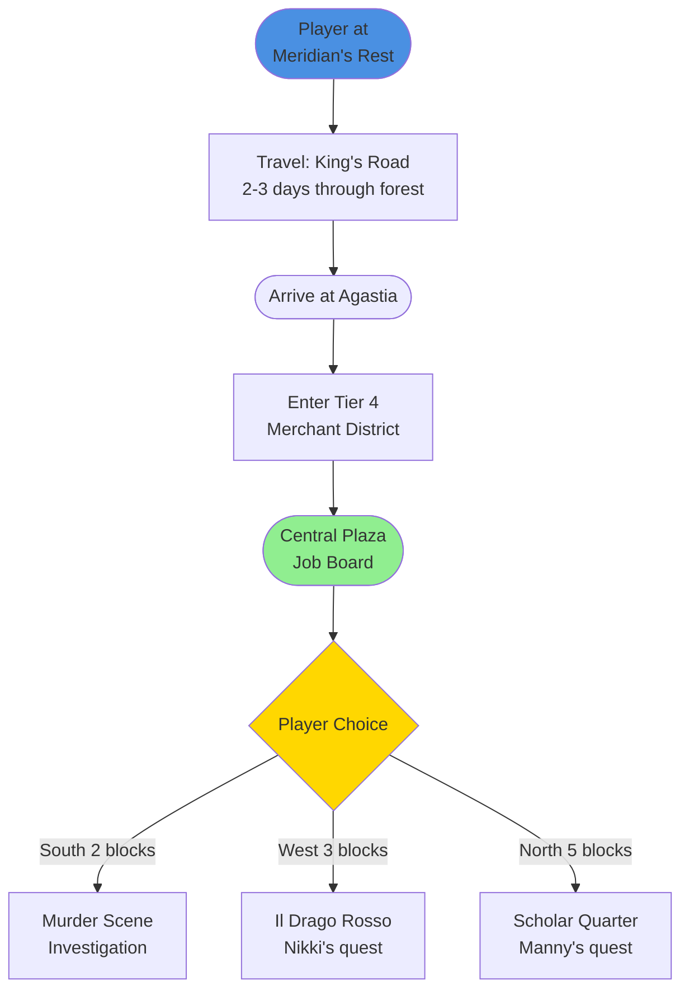

# Point Crawl Network

Master index of navigable nodes and their connections across all scales of the campaign.

**Philosophy:** Fractal point crawls - nodes within nodes. From world travel to room navigation, everything connects through described paths that create verisimilitude and player agency.

**Usage:**
- **At a node:** Present connection options to players
- **Moving between nodes:** Describe the chain of passage
- **Nested crawls:** Each node can contain its own point crawl

---

## Visual Map (Mermaid "Tube Map")

### World & City Scale Overview



### District Scale: Merchant District (Tier 4)



### Multi-Scale Navigation Example



---

## World Scale: Agastia Region

### Node: Meridian's Rest
- **Type:** Town
- **Scale:** World
- **Wikilink:** `[[Meridian's Rest]]`
- **Notion ID:** `2d9693f0c6b48133a84ce3e6e5fa5151` (from WIKI_INDEX)
- **Parent Node:** Agastia Region
- **Child Nodes:** Town locations (not yet mapped)

**Connections:**
```yaml
To Agastia:
  Distance: 48 miles (2 hexes)
  Travel Time: 2-3 days
  Terrain: Temperate Forests
  Path Description: "You follow the King's Road north through dense forest. The path is well-maintained but lonely, with towering pines blocking out much of the sky."
  Encounters: Roll on [[Inspiring Tables#Temperate Forests (Tier 1)]]

To Ratterdan Ruins:
  Distance: 24 miles (1 hex)
  Travel Time: 1 day
  Terrain: Temperate Forests
  Path Description: "The road south deteriorates as you approach the abandoned settlement. Cracked paving stones give way to overgrown trail."
  Encounters: Session 1 specific encounters
```

### Node: Agastia
- **Type:** City
- **Scale:** World
- **Wikilink:** `[[Agastia]]`
- **Notion ID:** `2d9693f0c6b48181a922fa18ec8b9ff2` (from WIKI_INDEX)
- **Parent Node:** Agastia Region
- **Child Nodes:** City-scale point crawl (9 tiers/districts)

**Connections:**
```yaml
To Meridian's Rest:
  Distance: 48 miles (2 hexes)
  Travel Time: 2-3 days
  Terrain: Temperate Forests
  Path Description: "You depart through the Southern Gate, following the King's Road as it winds through farmland before entering the deep forest."

To Northern Settlements:
  Status: Not yet mapped

To Eastern Coast:
  Status: Not yet mapped
```

---

## City Scale: Agastia Districts

**Parent:** Agastia city node

### Node: Tier 4 - Merchant District
- **Type:** District
- **Scale:** City
- **Wikilink:** `[[Merchant District]]`
- **Notion ID:** `2d9693f0c6b48166b4cfc92d45b0a850` (from WIKI_INDEX)
- **Parent Node:** Agastia
- **Child Nodes:** District-scale point crawl (locations within district)

**Connections:**
```yaml
To Scholar Quarter (Tier 3):
  Direction: North
  Path Description: "You ascend the worn stone steps of Scholar's Gate, passing through the archway adorned with carved books. The streets narrow and quieten as you climb into the academic district."
  Gate: Scholar's Gate
  Transition: Tier 4 → Tier 3 (requires merit or invitation)

To Dock District (Tier 6):
  Direction: East
  Path Description: "Harbor Road slopes downward toward the waterfront. The smell of salt and fish grows stronger as merchant stalls give way to warehouses and chandleries. You descend three tiers of switchback streets."
  Notable: Harbor Road (major thoroughfare)
  Transition: Tier 4 → Tier 6 (public access, descending)

To Noble Quarter (Tier 2):
  Direction: West
  Path Description: "You cross the Gold Bridge, an elegant stone span over the Inner Canal. Guards in ceremonial armor watch from both ends. The architecture becomes more ornate as you enter the estates district."
  Bridge: Gold Bridge (guarded)
  Transition: Tier 4 → Tier 2 (requires merit 50+ or invitation)

To Lower Residential (Tier 5):
  Direction: South
  Path Description: "You descend Craftsman's Way, where the shops gradually shift from luxury goods to practical trade. The crowds thicken and the buildings press closer together."
  Street: Craftsman's Way
  Transition: Tier 4 → Tier 5 (public access, descending)
```

### Node: Tier 3 - Scholar Quarter
- **Type:** District
- **Scale:** City
- **Wikilink:** `[[Scholar Quarter]]`
- **Notion ID:** `2d9693f0c6b481f1a43bfe09c80d16da` (from WIKI_INDEX)
- **Parent Node:** Agastia
- **Child Nodes:** District-scale point crawl

**Connections:**
```yaml
To Merchant District (Tier 4):
  Direction: South
  Path Description: "You descend Scholar's Gate, the carved stone steps leading back toward the bustling commerce below. The noise of the market rises to meet you."

To Research Quarter (Tier 2):
  Direction: West
  Path Description: "University Way leads deeper into the academic heart of Agastia. Lecture halls give way to sealed laboratories and warded research facilities. The guard presence increases."
  Transition: Tier 3 → Tier 2 (requires scholar credentials or merit 50+)

To Noble Quarter (Tier 2):
  Direction: North
  Path Description: "Archive Row curves upward past the great libraries, emerging in the estate district where nobles fund private collections."
  Transition: Tier 3 → Tier 2 (requires merit or invitation)
```

### Node: Tier 6 - Dock District
- **Type:** District
- **Scale:** City
- **Wikilink:** `[[Dock District]]`
- **Notion ID:** `2d9693f0c6b4810ea372e89e93aaa2e9` (from WIKI_INDEX)
- **Parent Node:** Agastia
- **Child Nodes:** District-scale point crawl

**Connections:**
```yaml
To Merchant District (Tier 4):
  Direction: West (upward)
  Path Description: "You climb Harbor Road's switchbacks, ascending from the waterfront through three tiers of increasingly prosperous streets. The smell of fish fades as you rise."

To The Depths (Tier 7):
  Direction: Down (literal descent)
  Path Description: "You descend into the subterranean tunnels beneath the docks. Water drips from ancient stonework. The city's official laws don't reach here."
  Transition: Requires local guide or knowledge of hidden entrances
  Warning: Dangerous, criminal territory
```

### Node: Tier 2 - Noble Quarter
- **Type:** District
- **Scale:** City
- **Wikilink:** `[[Noble Quarter]]`
- **Notion ID:** `2d9693f0c6b481a3b8cbcef7f51a7866` (from WIKI_INDEX)
- **Parent Node:** Agastia
- **Child Nodes:** District-scale point crawl

**Connections:**
```yaml
To Merchant District (Tier 4):
  Direction: East (downward)
  Path Description: "You cross back over Gold Bridge, leaving the estates behind. The guards nod as you pass, having verified your merit."

To The Castle (Tier 1):
  Direction: North (upward)
  Path Description: "The Road of Laurels ascends toward the Castle complex. Checkpoints increase. Only those with official business or high merit may pass."
  Transition: Requires merit 100+ or official summons
```

---

## District Scale: Merchant District Locations

**Parent:** Merchant District node

### Node: Central Plaza (Job Board)
- **Type:** Location
- **Scale:** District
- **Wikilink:** Referenced in `[[Merchant District]]` (no dedicated page)
- **Notion ID:** N/A (part of district page)
- **Parent Node:** Merchant District
- **Child Nodes:** None (destination)

**Connections:**
```yaml
To Murder Scene Alleyway:
  Direction: South
  Distance: 2 blocks
  Path Description: "You walk south past the silk merchant's colorful awnings and the warm smell of fresh bread from Goldwheat Bakery. Between them, a narrow alley opens to your right."
  Landmarks: Silk merchant, Goldwheat Bakery

To Il Drago Rosso:
  Direction: West
  Distance: 3 blocks
  Path Description: "Market Street stretches west from the plaza. You pass a weapons shop (Shadow's Edge Armory), a curiosity dealer, and a crowded tavern before the red dragon banner comes into view."
  Street: Market Street
  Landmarks: [[Shadow's Edge Armory]], curiosity dealer, tavern, red dragon banner

To Harbor Road (toward Docks):
  Direction: East
  Distance: 4 blocks
  Path Description: "You follow Merchant's Way east toward the waterfront. The street slopes gradually downward and the air begins to smell of salt and fish."
  Street: Merchant's Way

To Scholar's Gate (toward Scholar Quarter):
  Direction: North
  Distance: 5 blocks
  Path Description: "You walk north on Academy Avenue. The shops gradually shift from general goods to bookbinders and cartographers. The stone steps of Scholar's Gate rise ahead."
  Street: Academy Avenue
```

### Node: Murder Scene Alleyway
- **Type:** Location
- **Scale:** District
- **Wikilink:** Referenced in Session 3 (no dedicated page)
- **Notion ID:** N/A
- **Parent Node:** Merchant District
- **Child Nodes:** None (dead end alley)

**Connections:**
```yaml
To Central Plaza:
  Direction: North
  Distance: 2 blocks
  Path Description: "You return to Market Street, passing back between the bakery and silk merchant to the plaza."

Dead End:
  Description: "The alley ends at a brick wall thirty feet from the street. No other exits."
```

### Node: Il Drago Rosso
- **Type:** Location (Restaurant)
- **Scale:** District
- **Wikilink:** `[[Il Drago Rosso]]`
- **Notion ID:** `2d9693f0c6b4819b8f75f2331e02aa16` (from WIKI_INDEX)
- **Parent Node:** Merchant District
- **Child Nodes:** Interior point crawl (dining room, kitchen, private rooms - not yet mapped)

**Connections:**
```yaml
To Central Plaza:
  Direction: East
  Distance: 3 blocks
  Path Description: "You retrace your steps east on Market Street, passing the tavern, curiosity dealer, and Shadow's Edge Armory before reaching the plaza."

To Residential Streets:
  Direction: South
  Path Description: "Vine Street leads south into quieter residential blocks where merchant families live above their warehouses."
  Street: Vine Street
```

---

## Usage Examples

### At a Node (Present Options)

**Standing in Central Plaza (Job Board):**
> "You're in the bustling Central Plaza where the Job Board stands. Do you:
> - Walk south toward the murder scene (2 blocks, past silk merchant and bakery)?
> - Head west on Market Street to Il Drago Rosso (3 blocks, past armory and tavern)?
> - Go east on Merchant's Way toward the docks (4 blocks, descending)?
> - Travel north on Academy Avenue to Scholar's Gate (5 blocks, ascending)?"

### Moving Between Nodes (Chain Description)

**From Central Plaza to Il Drago Rosso:**
> "You walk west on Market Street. You pass Shadow's Edge Armory where a blacksmith hammers at an anvil, then a curiosity dealer's window full of strange trinkets, and finally a crowded tavern where laughter spills into the street. Three blocks from the plaza, you spot the red dragon banner hanging above a warm, inviting doorway."

**From Merchant District to Scholar Quarter:**
> "You walk north on Academy Avenue, passing bookbinders and cartographers as the shops shift toward academic trades. The street narrows and quietens. Ahead, worn stone steps rise through Scholar's Gate, an archway adorned with carved books. You climb into the academic district, where the air smells of parchment and ink."

---

## Nested Point Crawls (Fractal Structure)

```
Agastia Region (World Scale)
├─ Meridian's Rest
│  └─ Town Locations (not yet mapped)
├─ Agastia (City Scale)
│  ├─ Tier 1 - The Castle
│  │  └─ Castle Locations (not yet mapped)
│  ├─ Tier 2 - Noble Quarter
│  │  └─ Noble estates and locations (not yet mapped)
│  ├─ Tier 3 - Scholar Quarter
│  │  ├─ Archive of Lost Histories
│  │  └─ Other academic locations (not yet mapped)
│  ├─ Tier 4 - Merchant District (District Scale)
│  │  ├─ Central Plaza (Job Board)
│  │  ├─ Murder Scene Alleyway
│  │  ├─ Il Drago Rosso
│  │  │  └─ Interior rooms (not yet mapped)
│  │  └─ Other merchant locations (not yet mapped)
│  ├─ Tier 5 - Lower Residential
│  │  └─ Residential locations (not yet mapped)
│  ├─ Tier 6 - Dock District
│  │  └─ Dock locations (not yet mapped)
│  └─ Tier 7 - The Depths
│     └─ Underground locations (not yet mapped)
└─ Ratterdan Ruins
   └─ Ruin locations (Session 1 specific)
```

---

## Maintenance Notes

**Adding New Nodes:**
1. Determine scale (world, city, district, location, interior)
2. Identify parent node (what contains this?)
3. Add wikilink and Notion ID (from WIKI_INDEX.md or N/A if not synced)
4. Define connections with path descriptions
5. Update parent node's child list

**Connection Description Format:**
- **Direction:** Cardinal direction or relative position
- **Distance:** Travel time/distance if relevant
- **Path Description:** Immersive text describing the journey
- **Street/Route:** Named paths when applicable
- **Landmarks:** Notable features passed along the way
- **Transition Notes:** Tier changes, gates, checkpoints

**Wikilink Integration:**
- Nodes with dedicated entity pages use `[[Entity Name]]`
- Track Notion page ID from WIKI_INDEX.md
- Nodes without pages (like "Central Plaza") reference parent entity
- Update when new entity pages are created

## District Scale: Additional Agastia Locations

### Tier 3 - Scholar Quarter Locations

**Parent:** Scholar Quarter node

**Archive of Lost Histories**
- Wikilink: `[[Archive of Lost Histories]]`
- Notion ID: `2d9693f0c6b4810fad9efbecce91ade3`
- Connections to: Central Scholar Quarter plaza, University Way

**Other Scholar Quarter locations:** Research halls, lecture theaters, private libraries (not yet fully mapped)

### Tier 6 - Dock District Locations

**Parent:** Dock District node

**The Copper Mug (Tavern)**
- Wikilink: `[[The Copper Mug (Tavern)]]`  
- Notion ID: `2d9693f0c6b48199bd57e1c91c1d3af0`
- Connections to: Harbor Road, warehouse district, smuggler contacts

**Saltwind General Supply**
- Wikilink: `[[Saltwind General Supply]]`
- Notion ID: `2d9693f0c6b48166859df06a16bb95d0`
- Connections to: Dock warehouses, Harbor Road

**Other Dock locations:** Warehouses, shipyards, smuggling hideouts, underground entrances (not yet fully mapped)

### Tier 2 - Noble Quarter Locations

**Parent:** Noble Quarter node

**Blades of Glory (Weapon Shop)**
- Wikilink: `[[Blades of Glory]]`
- Notion ID: `2d9693f0c6b481cbb367fc15c9fa5afe`
- Connections to: Noble estates, training grounds

**The Grand Cathedral**
- Wikilink: `[[The Grand Cathedral]]`
- Notion ID: `2d9693f0c6b48194af2cdba4e5bccf96`
- Connections to: Temple district, noble estates

**Other Noble Quarter locations:** Private estates, exclusive clubs, art galleries (not yet fully mapped)

### Tier 5 - Lower Residential Locations

**Parent:** Lower Residential District node

**The Desperate's Refuge (Shop)**
- Wikilink: `[[The Desperate's Refuge]]`
- Notion ID: `2d9693f0c6b48114b5e3e3e5a21ba63f`
- Connections to: Residential streets, market alleys

**Sawbones Surgery**
- Wikilink: `[[Sawbones Surgery]]`
- Notion ID: `2d9693f0c6b48114bdeecdb82bd6d4c8`
- Connections to: Residential quarter, clinic row

**Other Lower Residential locations:** Apartment blocks, community centers, small markets (not yet fully mapped)

### Tier 7 - The Depths Locations

**Parent:** The Depths node

**Underground warrens, black markets, survival communities** (not yet mapped - dangerous area requiring local guide)

---

## Expansion Notes

**Current Status:** Core navigation framework complete for Session 3 areas (Merchant District detail, city-scale connections).

**To Expand:**
1. Add specific street names and landmarks between known locations
2. Map interior point crawls for key buildings (Il Drago Rosso dining room → kitchen, Archive reading room → vault)
3. Add Tier 1 (Castle) locations as campaign progresses
4. Detail The Depths underground network as players explore

**Maintenance:** Update Point_Crawl_Network.md as new locations are discovered or improvised during sessions. Add connection descriptions for any new paths players take.
