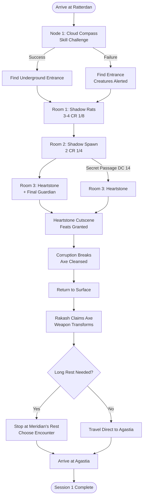

# Session 1: Ratterdan Investigation - DM Guide

**Party:** Level 1 (5 PCs with food buffs) | **Duration:** 2-3 hours | **Type:** Linear tutorial

---

## Quick Reference

<details>
<summary><b>Session Flow (Click to expand)</b></summary>

1. **Arrival at Ratterdan** → Describe smoking crater, giant's axe
2. **Node 1: Cloud Compass Skill Challenge** → Find underground entrance
3. **Node 2: Shadow Dungeon (3 rooms)** → Resource-draining combat
4. **Node 3: Heartstone Cutscene** → Feats granted, corruption breaks
5. **Node 4: Rakash Claims Axe** → Weapon transforms
6. **Node 5: Travel to Agastia** → Ad-hoc (Meridian's Rest if needed)

</details>

<details>
<summary><b>Key NPCs & Factions</b></summary>

- **None this session** - Solo exploration
- **Hidden Mastermind:** Octavia (Subject #8, unknown to party)

</details>

<details>
<summary><b>Important Items</b></summary>

- **Animated Heartstone:** Grants feats, breaks axe corruption
- **Giant's Axe:** Too large/cursed until cleansed, then Rakash claims it
- **Zhaask Symbols:** Draconic writing on axe (partial translation possible)

</details>

---

## Node 1: Cloud Compass Skill Challenge

<details>
<summary><b>Player Description</b></summary>

> As you approach the crater, you see the massive bluish-silver axe embedded at the center - clearly sized for a storm giant. Around the weapon, a dark storm cloud swirls unnaturally, trapped in place. The cloud doesn't dissipate or drift - it hovers, pulsing with electrical energy, as if bound to the axe itself.
>
> Reality warps visibly around the artifact. Leaves fall upward in pockets of fey energy. Time seems to flow irregularly in zones near the crater's edge.

</details>

<details>
<summary><b>DM Notes - Skill Challenge</b></summary>

**Goal:** Party discovers the cloud is pointing underground like a compass

**Structure:** 3 successes before 2 failures

**DC:** 12-14 for all checks

**Possible Skills:**
- **Arcana:** Understand cloud's magical nature, recognize it as directional pointer
- **Investigation:** Examine axe position relative to cloud direction
- **Nature:** Read storm cloud behavior, recognize it's unnatural/bound
- **Perception:** Notice cloud isn't random, has consistent direction
- **Survival:** Use cloud as navigational tool, track direction

**Success:** Party realizes cloud points underground → find entrance to chamber
**Failure:** Find entrance eventually BUT:
- Dungeon creatures alerted (no surprise)
- OR time pressure (weather worsens)
- OR environmental hazard triggered

</details>

<details>
<summary><b>Axe Examination</b></summary>

**If players examine the axe closely:**
- Sized for storm giant (20+ feet tall)
- Bluish-silver metal, masterwork quality
- **Corruption seed visible:** Dark energy pulsing through weapon
- **Zhaask symbols** etched near base (Draconic language)
- Touching causes 1d4 psychic damage (warn them!)
- Cannot be moved (DC 25+ STR, basically impossible)

**Partial Translation (if Draconic speaker):**
Player can read fragments: "...storm... bond... dragon..." (full translation requires research)

</details>

---

## Node 2: Underground Shadow Dungeon

<details>
<summary><b>Player Description - Entrance</b></summary>

> Following the cloud's direction, you find a collapsed section of ruins where the ground has caved in, revealing a dark passage descending underground. The air is cold, and shadows seem to move unnaturally along the walls. A faint purple glow emanates from somewhere deep below.

</details>

<details>
<summary><b>Dungeon Map & Ecology</b></summary>

**Layout:** 3 rooms, linear with one loop option

```
[Entrance]
    |
[Room 1: Shadow Rats]
    |
[Room 2: Shadow Spawn] <--loop--> [Secret Passage]
    |                                    |
[Room 3: Heartstone Chamber] <----------+
```

**Jaquaysing Elements:**
- Secret passage from Room 2 → Room 3 (Investigation DC 14)
- Allows bypassing some encounters
- Verticality: Rats use ceiling cracks, spawn use walls

**Lighting:** Dim to dark (party needs light sources)

**Ecology Notes:**
- Shadow creatures spawned from axe corruption
- Feed on magical energy (spell slots, class features)
- Will collapse when corruption source removed
- See full ecology: Dungeon_Ecologies/Ratterdan_Underground_Ecology.md

</details>

<details>
<summary><b>Room 1: Shadow Rats (Warm-up Encounter)</b></summary>

### Player Description
> The passage opens into a small chamber. The purple glow is stronger here. Shadowy forms skitter along the walls and ceiling - rats, but wrong. Their bodies seem to absorb light, leaving trails of darkness.

### Encounter
**Creatures:** 3-4 Shadow-Touched Rats (CR 1/8 each)

**Tactics:**
- Pack tactics (advantage when ally adjacent)
- Attack from ceiling (drop attacks)
- Target isolated PCs
- Flee to Room 2 if reduced to 1 rat

### Stat Block
- **AC:** 12
- **HP:** 7 (2d6) each
- **Speed:** 30ft, climb 30ft
- **Attack:** Bite +4, 1d4+2 piercing
- **Special - Nibble Essence:** On crit, drains 1 use of minor ability (Second Wind, Bardic Inspiration, etc.)
- **Pack Tactics:** Advantage when ally within 5ft of target

### DM Notes
- Introduce resource drain mechanic
- Show that shadows are dangerous but beatable
- Let party test tactics in low-stakes fight

</details>

<details>
<summary><b>Room 2: Shadow Spawn (Serious Threat)</b></summary>

### Player Description
> This larger chamber pulses with corruption. Two humanoid shadows detach from the walls, their forms flickering between solid and ethereal. They move with unnatural fluidity, reaching toward you with shadowy claws.

### Encounter
**Creatures:** 2 Shadow Spawn (CR 1/4 each)

**Tactics (Tucker's Kobolds):**
- Use darkness to hide (bonus action Hide in dim/dark)
- Attack from unexpected angles (walls, ceiling if incorporeal)
- Focus fire on casters/healers (drain spell slots)
- Retreat to walls when bloodied
- Guard path to Room 3 (won't pursue far)

### Stat Block
- **AC:** 12
- **HP:** 9 (2d8) each
- **Speed:** 40ft
- **Attack:** Shadow Touch +4, 1d6+2 necrotic damage
- **Special - Power Drain:** On hit, target makes DC 12 WIS save or lose:
  - 1 spell slot (lowest level), OR
  - 1 use racial/class feature (player choice), OR
  - 1d4 temp HP if no resources
- **Shadow Convert:** Spawn regains HP equal to spell slot level drained
- **Sunlight Sensitivity:** Disadvantage in bright light
- **Shadow Stealth:** Bonus action Hide in dim/dark

### DM Notes
- **Resource management test** - drain spell slots/features
- Can be deadly if party bunches up
- Secret passage (Investigation DC 14) bypasses this fight
- Environmental hazard: Corruption pools (DEX DC 10 or difficult terrain)

</details>

<details>
<summary><b>Room 3: Heartstone Chamber (Finale)</b></summary>

### Player Description
> The passage opens into a circular chamber carved from ancient stone. At the center, partially buried in rubble, a purple crystalline heart pulses with fey energy. The light you've been following emanates from this artifact. Shadows writhe protectively around it.

### Finding Heartstone
- **Perception DC 12** or **Investigation DC 10** to find among rubble
- **Detect Magic:** Strong fey aura, transmutation school
- Size of human fist, warm to touch

### Final Guardian (Optional)
**Creatures:** 1-2 Shadow Spawn (same stats as Room 2)

**OR Environmental Challenge:**
- Corruption zones (must navigate carefully)
- Skill challenge to retrieve Heartstone safely
- Use if party is low on resources

### The Heartstone Cutscene

**When party touches/retrieves Heartstone:**

1. **Animation:**
   > The crystal heart begins to shift and change, transforming into [DM CHOICE: shape?]. Fey energy pulses visibly through its form.

2. **Feat Granting:**
   > Purple light EXPLODES from the Heartstone, washing over each of you.
   >
   > **[To each PC individually]:** You see a vision of your deepest desire...
   > - **Manny:** Blade and magic becoming one
   > - **Nikki:** Shadow and arcane merging
   > - **Rakash:** Primal fury perfected
   > - **Kyle:** Rainbow spectrum expanding
   > - **Josh:** Markings glowing with purpose
   >
   > The power manifests within you - you gain a new feat immediately!
   >
   > The light reclaims back into the Heartstone.

3. **Evil Laugh:**
   > An evil, echoing laugh reverberates through the chamber. The Heartstone goes dormant.

4. **Corruption Breaking:**
   > You feel a tremendous pulse of energy surge UPWARD through the earth, traveling from the Heartstone toward the surface. Above you, you hear a tremendous CRACK.

### DM Notes
- Feats are permanent even if Heartstone lost
- **Critical:** If Heartstone destroyed, party LOSES feats
- Heartstone can be taken or left (player choice)
- Corruption pulse breaks axe curse above

</details>

---

## Node 3: Rakash Claims the Axe

<details>
<summary><b>Player Description - Return to Surface</b></summary>

> As you emerge from the underground chamber, you see immediate changes. The dark corruption pulsing through the giant's axe has SHATTERED - the weapon now gleams with clean, bluish-silver light. The storm cloud dissipates, finally free.
>
> The reality warps around Ratterdan fade. The upward-falling leaves drift normally. Time stabilizes.
>
> **[To Rakash]:** You feel an overwhelming compulsion pulling you toward the weapon. Something deep within recognizes this axe as YOURS.

</details>

<details>
<summary><b>The Claiming Event</b></summary>

**When Rakash approaches and touches the axe:**

> As your hand makes contact with the weapon, it SHRINKS. The massive 20-foot giant's axe reduces in size, transforming into a weapon perfectly sized for you to wield. The bluish-silver metal gleams, free of corruption.
>
> You feel dormant power within it - the Storm Bond ability, waiting to activate when lightning strikes.

### Axe Transformation
- **Before:** Giant-sized (unusable), cursed, corrupted
- **After:** Medium-sized (usable), cleansed, evolving weapon
- **Storm Bond:** Dormant but present (see Giant_Axe_Artifact.md)
- **Rakash:** Can now wield as primary weapon

</details>

<details>
<summary><b>DM Questions (Answer During Session)</b></summary>

- What shape did Heartstone take when animated?
- Did Heartstone go dormant or stay animated?
- Did party take Heartstone with them?
- How did Rakash's player react to the compulsion/axe claiming?

</details>

---

## Node 4: Travel to Agastia

<details>
<summary><b>Travel Options (Ad-hoc)</b></summary>

**Option A: Direct to Agastia**
- Party pushes through without rest
- Narrate travel, arrive exhausted but safe
- Session ends at Agastia arrival

**Option B: Stop at Meridian's Rest**
- Party needs long rest after dungeon
- Choose encounter type:
  - **Dream Sequence:** Visions related to Heartstone/feats
  - **Night Attack:** 2-4 bandits/wolves (CR 1/8)
  - **Social at Inn:** Meet NPC, foreshadow Agastia
- Then travel to Agastia

</details>

---

## Post-Session Debrief Questions

**Ask player/DM after session:**
1. What did the party learn/discover?
2. What questions are they asking?
3. Which mysteries hooked them most?
4. Any PC character development moments?
5. What resources did they burn? (spell slots, HP, features)
6. Did they take the Heartstone?
7. What's their plan for next session?

**Then update:**
- PC knowledge sections
- Location files (Ratterdan stabilized)
- Prepare Session 2 branching goals

---

## Mermaid Flowchart


