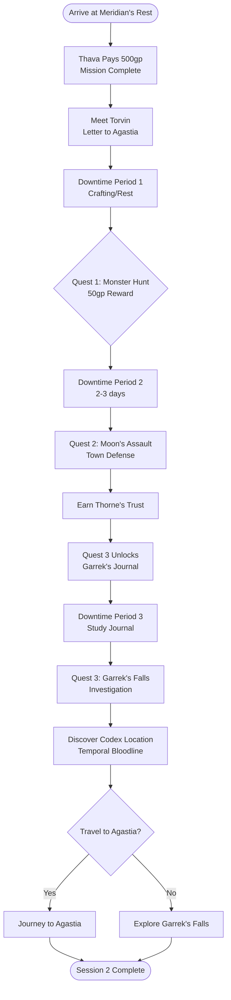

# Session 2: Road to Agastia - DM Guide

**Party:** Level 2 (5 PCs, corruption cleared) | **Duration:** 3-4 hours | **Type:** Quest hub + downtime

## Session Flowchart

## Quick Reference

**Toggle: Session Flow**
  1. **Opening:** Thava pays 500gp, party meets Torvin (letter to Agastia)
  2. **Quest 1:** Monster Hunt on trade road (50gp, combat test)
  3. **Quest 2:** Defend town from Moon's Assault (no pay, earn trust)
  4. **Quest 3:** Investigate Garrek's Falls (100gp + artifacts, unlocks Codex quest)
  5. **Downtime:** Crafting, investigation, personal quests between missions

**Toggle: Key NPCs**
  - **Torvin Greycask (they):** Goblin messenger from Agastia with letter for party
  - **Brian Thornscale (Mayor):** Human patron who hired party for corruption quest
  - **Thorne "The Bear" Kallister:** Retired adventurer, quest giver, Garrek's friend
  - **Assistant Bellweather:** Mayor's assistant
  - **Greta Moss:** Apothecary (15-20% discount on materials)
  - **Aldwin Quill:** Scribe (15-20% discount on scrolls)

**Toggle: Quest Rewards**
  - **Opening:** 500gp from Thava for clearing corruption
  - **Quest 1:** 50gp for monster hunt
  - **Quest 2:** Thorne's trust and respect (no gold)
  - **Quest 3:** 100gp + "whatever Garrek left behind" + Garrek's journal
  - **Downtime:** Crafting discounts from grateful townsfolk

**Toggle: Important Items & Locations**
  - **Garrek's Journal:** Map fragment, warnings about addictive water, mentions "book" and "time seems wrong"
  - **Codex of Peace:** 7-page artifact at Garrek's Falls (referenced in journal)
  - **Garrek's Falls:** Hidden Underdark sanctuary with healing waters (HIGHLY addictive)
  - **Temporal Bloodline Tribe:** Guardians of the Falls (potential allies)

**Toggle: Player Hints (Distribute During Downtime)**
  - **Kyle/Nameless:** Rumors about Geist's smuggling operation in Agastia
  - **Manny:** Garrek's journal mentions ancient book at the Falls
  - **Nikki:** Journal notes "time seems wrong" near Falls (temporal magic)
  - **Josh/Brand:** Thorne's war stories may reference elemental ancestors
  - **Ian/Rakash:** Storm Giant information from Thorne's adventuring days

## Nodes

### Opening: Payment & Introductions

**Thava's Payment:**

> The Merit Council representative arrives at Meridian's Rest, accompanied by guards. Thava Thornscale, a dragonborn official, approaches your group with a formal bow.
>
> "The corruption is cleared. The town is safe. The Merit Council honors its contracts."
>
> They produce a heavy coin purse. "500 gold pieces, as agreed."

**Meeting Torvin:**

After payment, a goblin messenger approaches - Torvin Greycask.

**Torvin (they):**
- From Agastia, not wealthy district
- Came from Cantel
- Carries letter for the party: "Heard you might be traveling to Agastia. I have a letter that needs delivering to [patron name]. Pay well if you take it."
- Payment: 5gp for delivering letter + basic intel about Agastia

**DM Notes:**
- Party now has substantial gold (500gp + leftover from Session 1)
- Torvin provides hook for eventual Agastia travel
- Mayor Brian Thornscale and Thorne Kallister are separate NPCs

---

### Quest 1: Monster Hunt

**Quest Giver:** Thorne "The Bear" Kallister

**Hook:**

> Thorne approaches you at the tavern. Broad-shouldered with a thick salt-and-pepper beard, weathered face, and a slight limp from an old injury.
>
> "You handled that corruption well. The town's grateful. But we've got another problem - creature on the trade road. Merchants won't travel until it's gone. 50 gold if you take care of it."

**Objective:** Kill/drive off creature threatening trade road

**Combat Encounter:**

**Toggle: Creature Options (Choose One)**
  - **Displacer Beast:** CR 3 (challenging for level 2)
  - **Owlbear:** CR 3 (classic dangerous beast)
  - **Young Basilisk:** CR 2 (petrification danger)

**DM Notes:**
- Thorne is evaluating party's combat capability
- He watches how they work together, handle tactics
- Success earns his respect (prerequisite for Quest 3)

---

### Quest 2: Defend Against Moon's Assault

**Quest Giver:** Thorne "The Bear" Kallister

**Hook:**

> Thorne finds you after Quest 1. He's more serious this time.
>
> "You fight well. Good. Because in two nights, we'll need every blade. The Moon's Assault - happens every few months. Lycanthropes and berserkers come down from the hills. We defend the walls or people die."
>
> "There's no pay for this. Just survival."

**Objective:** Defend Meridian's Rest from attacking forces

**Combat Encounter:**

**Toggle: Enemy Composition**
  - **Wave 1:** 6 Berserkers (CR 2 total) attacking east gate
  - **Wave 2:** 2 Werewolves (CR 3 each) + 4 Wolves attacking north gate
  - **Final Wave:** 1 Werebear (CR 5) leading final push

**Thorne's Role:**
- Fights alongside party (limited due to old injury - limp)
- Provides tactical advice during battle
- Shields weaker party members if they're in danger

**DM Notes:**
- **Success Condition:** Prevent breaches, minimize civilian casualties
- Earns Thorne's deep trust (unlocks Quest 3)
- Thorne shares personal story after battle (Garrek, his old party)
- No gold reward - this is about community defense

---

### Quest 3: Investigate Garrek's Falls

**Quest Giver:** Thorne "The Bear" Kallister (Unlocks After Quests 1 & 2)

**Hook:**

> After the Moon's Assault, Thorne takes you aside. He seems conflicted.
>
> "You've earned my trust. So I'll share something personal. Twenty years ago, my party explored the Underdark. My friend Garrek found a waterfall - said it had healing properties. Miraculous healing. But he died before we could return."
>
> He hands you a partially burned journal.
>
> "I want to know what happened to him. What he found. 100 gold for the truth. Plus... whatever Garrek left behind is yours."

**Garrek's Journal (Handout):**

**Toggle: Journal Contents**
  - **Map Fragment:** Partial route to Garrek's Falls from Meridian's Rest
  - **Entry 1:** "The waters heal anything. Regrew Torvan's finger in minutes."
  - **Entry 2:** "Strange. Time seems... wrong near the Falls. Clocks run backward."
  - **Entry 3:** "Found a book. Seven pages, metal, bound to a pedestal. Can't read it."
  - **Entry 4:** "Torvan tried to drink more water. Had to drag him away. ADDICTIVE."
  - **Entry 5 (burned):** "...tribe guards it... temporal... don't trust..."

**Objective:** Travel to Garrek's Falls, discover what happened, report back

**Location:** Garrek's Falls (Underdark)

**Toggle: Garrek's Falls Features**

**Healing Aura:**
- Continuous *lesser restoration* effect from moisture in air
- Removes diseases, poisons, curses passively

**Healing Waters (DANGER):**
- Single draught: Regrows limbs, restores all HP, cures diseases, raises dead (<72hrs)
- **DC 12 Wisdom Save:** On failure, compelled to drink more (will drown trying)
- **Evidence:** Skeletal remains in pool (DC 20 Perception to notice before drinking)

**The Codex of Peace:**
- 7 metal pages bound to stone pedestal
- Protected by Temporal Bloodline Tribe
- Zone prevents violence, ill will, evil acts
- Removal without keyword → explosion (pages scatter as blue energy)

**Temporal Bloodline Tribe:**
- Guardians of the Falls and Codex
- Possess temporal magic abilities
- May recognize Nikki's interest in temporal power
- Potential allies if approached peacefully

**DM Notes:**
- Party can discover Codex location without removing it
- Temporal Bloodline connection for Nikki's arc
- Manny's artifact quest hook
- Josh/Brand may learn about elemental ancestors
- This location becomes important for future sessions

---

### Downtime Activities

**Available Between Quests**

**Timeline:**
- **Period 1:** After opening, before Quest 1 (1-2 days)
- **Period 2:** Between Quest 1 and Quest 2 (2-3 days)
- **Period 3:** After Quest 2, before Quest 3 (1-2 days)
- **Period 4:** After Quest 3 (variable - party choice)

**Toggle: Crafting System**

**Meridian's Rest as Crafting Hub:**
- Population ~2000 (half transient travelers)
- Function: Resupply hub for Agastia-bound adventurers
- Grateful townsfolk offer 15-20% discounts

**NPCs:**
- **Greta Moss (Apothecary):** Potions, poisons, ingredients
- **Aldwin Quill (Scribe):** Scrolls, inks, paper

**Crafting Options:**
- **Healing Potion:** 1 day, 25gp (or 12gp if gather moonbell flowers)
- **Greater Healing:** 2 days, 100gp (or 50gp if gather silverleaf + cave crystals)
- **Spell Scrolls:** 1-3 days, 15-250gp depending on spell level
- **Antitoxin:** 1 day, 50gp (or 25gp with ingredients)
- **Alchemist's Fire:** 1 day, 50gp

**Gathering Ingredients:**
- **Moonbell Flowers:** Medicine/Nature DC 12, 1d4 hours, nearby forest
- **Silverleaf:** Survival DC 14, 2d4 hours, deep forest
- **Cave Crystals:** Investigation DC 13, 2d4 hours, local caves

**Toggle: Personal Investigations**

**Kyle/Nameless:**
- Investigate Geist rumors (Persuasion/Investigation DC 12)
- Learn Geist has Merit Council position in Agastia
- Rumors of smuggling operation in dock district

**Manny:**
- Study Garrek's journal (Investigation DC 10)
- Identify references to ancient book (Codex)
- Map fragment points to Underdark location

**Nikki:**
- Study journal's temporal references (Arcana DC 13)
- "Time seems wrong" suggests temporal magic or anomaly
- Temporal Bloodline Tribe may have answers

**Josh/Brand:**
- Talk with Thorne about his adventuring days (no check)
- Thorne mentions elemental phenomenon in Underdark
- Old legends about civilization with elemental powers

**Ian/Rakash:**
- Ask Thorne about Storm Giants (History/Persuasion DC 10)
- Thorne heard of Storm Giant brigade near coastal regions
- May have information about Rakash's revenge quest

---

## Post-Session Debrief

**Toggle: Debrief Questions**

**Ask player/DM after session:**
1. Which quests did the party complete?
2. Did anyone die/nearly die during Moon's Assault?
3. Did party discover Garrek's Falls? What did they do with the Codex?
4. What did players craft during downtime?
5. Which personal investigations did PCs pursue?
6. Did anyone drink the healing waters? (CRITICAL - addiction check)
7. What's the party's next move - Agastia or deeper investigation?

**Then update:**
- PC knowledge sections with new discoveries
- Codex location now known (if Quest 3 completed)
- Temporal Bloodline Tribe relationship status
- Track any addictions to healing waters
- Prepare Session 3 based on party choice (Agastia vs Garrek's Falls)
