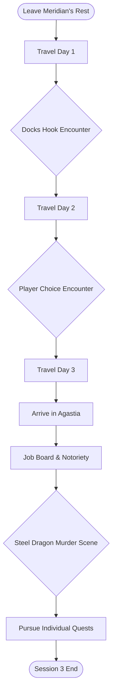

# Session 3: The Steel Dragon Begins - DM Guide

**Party:** Level 2 (5 PCs) | **Duration:** 3-4 hours | **Type:** Travel & City Introduction

## Session Flowchart

## Quick Reference

**Toggle: Session Flow**
1.  **Travel to Agastia:** 2-3 day journey with themed encounters.
2.  **Kyle's Hook:** An encounter on the road that points Kyle towards the docks and Geist.
3.  **Player Choice Encounter:** An encounter that can be resolved in multiple ways.
4.  **Arrival in Agastia:** First impressions of the city.
5.  **Job Board:** Introduction to the system for gaining money and merit.
6.  **The Steel Dragon:** The first murder scene is discovered.
7.  **Player Quest Hooks:** Opportunities for Manny and Nikki to get involved in their quests.

**Toggle: Key NPCs**
- **Corvin Tradewise:** Merchant caravan leader who can provide information about Geist.
- **Wounded Smuggler:** An NPC who provides a direct hook to Geist and the docks.
- **Job Board Clerk:** An NPC who explains the job board and merit system.
- **City Guard Captain:** The NPC who is investigating the first Steel Dragon murder.

**Toggle: Important Items & Locations**
- **Bloody Crate:** A crate with a strange symbol, pointing to a smuggling operation.
- **Agastia Job Board:** A central location for quests and gaining merit.
- **The Murder Scene:** An alley in the Merchant District where the first victim of the Steel Dragon is found.

## Travel to Agastia (2-3 Days)

**Route:** Meridian's Rest → Agastia
**Distance:** ~48 miles (2 hexes at 24mi/hex world scale)
**Travel Time:** 2-3 days at normal pace (24 mi/day)
**Terrain:** Temperate Forests
## TEMPERATE FORESTS (Tier 1)
**Roll 2d8**

| 2d8 | Encounter Theme |
|-----|-----------------|
| **2** | **Helpful Sprite Circle** |
| | A ring of mushrooms glows faintly in a moonlit glade where sprites feast on honeyed cakes and fermented berry wine. They're jovial and welcoming—”offering the party rest, food, and magical guidance in exchange for stories or songs. The sprites can point toward nearby points of interest, warn of dangers ahead, or grant a minor blessing (advantage on next Survival check). **Variation:** One sprite is actually a disguised pixie with access to polymorph and confusion, testing the party's worthiness. **Non-Combat:** The sprites offer to become allies if the party plants enchanted acorns at three specific locations, creating new faerie rings across the forest. |
| **3** | **Lost Mastiff** |
| | A skeletal, starving mastiff watches the party from the undergrowth, too scared to approach. It wears a rotted leather collar with a noble family's crest. If offered food, it bonds with whoever feeds it first and becomes fiercely loyal. **Variation:** The dog is being tracked by a bugbear who wants to eat it—”the bugbear arrives in 1d4 rounds after the party encounters the dog. **Non-Combat:** Following the collar's crest leads to a ruined estate where the dog's original owners were killed by bandits; treasure remains hidden in the wreckage. |
| **4** | **Awakened Shrub Choir** |
| | The party stumbles into a clearing where awakened shrubs sway and sing in terrible, off-key harmony. They're practicing for the Seasonal Celebration and desperately want an audience. The shrubs are harmless but incredibly annoying. **Variation:** One shrub is actually a twig blight spy sent by a gulthias tree—”it tries to lead the party into a trap. **Non-Combat:** If the party gives honest (even critical) feedback and helps them practice, the shrubs share knowledge of a nearby hidden spring that grants temporary hit points when drunk (1d8+1 temp HP, lasts until next rest). |
| **5** | **Pseudodragon Quarrel** |
| | Two pseudodragons are locked in an aerial squabble over a shiny object (a silver locket). They dive and snap at each other, occasionally crashing into trees. Neither wants to back down from this territorial dispute. **Variation:** The locket is actually cursed—”whoever touches it becomes the next target of their conflict until it's returned to its resting place (an old grave nearby). **Non-Combat:** The party can adjudicate the dispute; the grateful winner becomes a temporary companion for 1d4 days, or both pseudodragons flee, dropping the locket (worth 25 gp, or more if returned to rightful owner's family). |
| **6** | **Wandering Druid** |
| | An elderly druid sits by a babbling brook, smoking a pipe carved from oak root. She's monitoring the health of the forest and notes that "something dark stirs in the old hollow." She can provide healing, identify plants, and share rumors. **Variation:** She's actually a green hag in disguise, testing the party's intentions—”if they're cruel to nature, she becomes hostile. **Non-Combat:** If the party helps her gather medicinal herbs or clear corruption from a nearby grove, she grants them a charm that allows one free casting of *speak with animals*. |
| **7** | **Unicorn Sighting** |
| | A flash of silver-white catches the corner of someone's eye—”a unicorn stands at the forest's edge, watching the party with intelligent eyes. It bolts immediately, but those who saw it feel blessed (advantage on their next saving throw). **Variation:** If the party can track it (DC 16 Survival check with disadvantage—”it's very fast), they find it wounded by goblin arrows, creating a moral choice. **Non-Combat:** Healing the unicorn (or choosing not to pursue it) grants a more powerful blessing: the unicorn's horn glows and leaves behind a single silver hair that can cure one disease or poison (no action required). |
| **8** | **Goblin Ambush Site** |
| | The forest goes silent. Worg tracks and goblin footprints surround a freshly dug pit covered with branches and leaves. Crude wooden spikes line the bottom (2d6 piercing damage, DC 12 Dex save to avoid). Goblins watch from the bushes, hoping their trap succeeds. **Variation:** Instead of a few goblins, a bugbear leads the ambush party, using the goblins as expendable shock troops. **Non-Combat:** Keen-eyed characters (DC 14 Perception) spot the trap before triggering it and can either avoid it, disarm it, or turn it against pursuers. |
| **9** | **Spider's Hunting Ground** |
| | Massive webs stretch between ancient oaks, glistening with dew. Giant wolf spiders lurk in the canopy, and cocooned corpses dangle from branches—”some still twitching. An ettercap commands the spiders from a higher perch, chittering orders. **Variation:** One cocoon contains a still-living noble who will pay handsomely for rescue (or the spiders are defending egg sacs that will hatch in days, flooding the forest). **Non-Combat:** Sneaking through (DC 15 Stealth group check) or using fire to clear a safe path avoids the fight; investigating cocoons yields 2d20 gp in valuables. |
| **10** | **Territorial Owlbear** |
| | The earth shakes with heavy footfalls. An owlbear crashes through the underbrush, feathers bristling and beak clacking. It's protecting its nearby nest and views all intruders as threats. **Variation:** The owlbear is diseased or maddened by corrupted water, making it even more aggressive and unpredictable (add 10 HP, disadvantage to calm it). **Non-Combat:** A successful DC 16 Animal Handling check or offering 3 days of rations as a peace offering makes it back down; the party can choose to investigate the nest (containing a shiny obsidian egg worth 50 gp to collectors). |
| **11** | **Stirge Storm** |
| | A high-pitched buzzing fills the air as a thirst of stirges drops from the canopy like a crimson cloud. They're ravenous, having fed on a dying deer nearby. Blood frenzy makes them fearless. **Variation:** So many stirges descend that they count as two swarms instead of individual creatures; or they're fleeing from something even worse (a young green dragon arrives in 1d6 rounds). **Non-Combat:** Characters who immediately drop prone and cover themselves can avoid the initial assault (DC 13 Dex save); smoke or fire drives them off without a fight. |
| **12** | **Grick Ambush** |
| | Stone outcroppings line the forest path—”except they're not stone. Gricks slither from rocky crevices, their tentacles probing for prey. They've been starving and desperate for weeks. **Variation:** One grick is much larger (use grick alpha stats if available, or double HP), the alpha of the pack. **Non-Combat:** Tossing fresh meat (3 rations worth) into the rocks distracts them long enough to flee; following their trails leads to a cave filled with bones and 3d20 gp in coins. |
| **13** | **Hobgoblin Hunting Party** |
| | The crack of branches and barked orders in Goblin heralds the approach of disciplined hobgoblin scouts. They're tracking a thief who stole from their war band—”an urchin who nabbed food to feed his starving siblings. **Variation:** The hobgoblins are led by a captain who carries a banner marked with the symbol of a distant warlord—”killing him draws attention from a larger force. **Non-Combat:** The party can negotiate (hobgoblins respect strength and honesty), hand over the thief, hide the thief and bluff (DC 15 Deception), or learn the thief's location is in a nearby hollow tree. |
| **14** | **Corrupted Grove** |
| | A massive oak dominates a darkened grove, its trunk split and oozing shadow. Needle blights, twig blights, and vine blights emerge from the corruption, attacking mindlessly. At the center, liquid shadow bubbles from the tree's wound. **Variation:** The corruption is spreading—”a young gulthias tree is taking root, and if not destroyed, will spawn more blights weekly. **Non-Combat:** A DC 14 Nature or Religion check reveals the corruption can be cleansed with holy water and fire; doing so without fighting requires stealth (DC 16) but destroys the threat permanently. |
| **15** | **Ankheg Eruption** |
| | The ground trembles and explodes upward as an ankheg bursts from below, mandibles clacking. Its carapace bears strange metal tags—”someone has been studying it. **Variation:** The ankheg is protecting its burrowed eggs (3 eggs worth 100 gp each to scholars or tamers). **Non-Combat:** Investigations reveal the tags bear a wizard's mark; following the trail leads to an eccentric researcher who will pay 50 gp for information on the ankheg's behavior and location. |
| **16** | **Green Dragon's Domain** |
| | The forest grows unnaturally quiet and dark. Acrid fog rolls between the trees. A green dragon wyrmling watches from a high branch, studying the party with ancient, intelligent eyes. It speaks, offering a "trade"—”information for secrets, or safe passage for tribute. **Variation:** The wyrmling is genuinely curious and might become a recurring NPC if treated well, or it's setting up an ambush with goblin allies hidden nearby. **Non-Combat:** Clever negotiation, offering valuable information (secrets about local politics, treasure locations), or appealing to its vanity can result in the wyrmling letting the party pass or even granting a warning about nearby dangers. The wyrmling might demand one magic item or 50 gp in tribute.

### Day 1: The Bloody Crate (Kyle's Hook)

**Encounter:** The party comes across an overturned cart on the side of the road. A wounded man is hiding nearby.

> The road ahead is partially blocked by an overturned cart, its contents spilled across the dirt. A single crate, stained with a dark, still-wet substance, lies a short distance away. A faint groan can be heard from the nearby woods.

**The Wounded Man:**
- A low-level smuggler, ambushed by rivals.
- He was supposed to deliver the crate to "Geist" at the Agastia docks.
- He is dying and will only be able to utter a few words: "Geist... Warehouse 7... Docks...".
- **The Crate:** Contains mundane goods, but has a small, almost invisible symbol of a coiled serpent on it. This is a marker for Geist's operation.

**DM Notes:**
- This provides a direct hook for Kyle (Nameless) to the docks and Warehouse 7.
- The symbol on the crate can be used to identify other parts of the smuggling operation in Agastia.

### Day 2: Player's Choice

**Encounter:** Choose one of the following from the Inspiring Table or create a new one based on player actions.

**Option 1: The Lost Mastiff (from Inspiring Table)**
- A chance for a non-combat encounter and to gain a loyal animal companion.

**Option 2: The Wandering Druid (from Inspiring Table)**
- An opportunity for healing, information, and a potential side quest.

**Option 3: The Goblin Ambush Site (from Inspiring Table)**
- A classic combat encounter.

### Day 3: Arrival in Agastia

> The road crests a hill, and the city of Agastia unfolds before you. A tiered metropolis of stone and ambition, with the towering Northern Wall and the sky-piercing Inverse Tower. Airships drift lazily from the upper docks, their magical sails aglow.

## Welcome to Agastia

### The Job Board (Money & Notoriety)

**Location:** A large, well-maintained board in the central plaza of the Merchant District (Tier 4).

**The Clerk:** A bored but efficient Merit Council clerk sits at a nearby desk.

> "Welcome to Agastia. If you're looking for work, you've come to the right place. Complete a job, get paid, and earn merit. The more merit you have, the higher you climb. Simple as that."

**How it Works:**
- Jobs are posted with a description, a reward (gold), and a merit value.
- Completing jobs increases a character's Merit Rank, which unlocks access to higher tiers and more opportunities.
- This is the primary way for outsiders to gain standing in Agastia.

**Sample Jobs:**
- **Rat Extermination (Tier 5):** 10gp, 1 Merit
- **Guard a Caravan (Tier 4):** 50gp, 5 Merit
- **Investigate Missing Person (Tier 3):** 100gp, 10 Merit

### The First Cut: The Steel Dragon's Debut

**Location:** A quiet alleyway in the Merchant District, not far from the Job Board.

> A crowd has gathered, held back by a pair of city guards. Inside the alley, a scene of gruesome artistry is revealed. A wealthy merchant, dressed in fine silks, is slumped against a wall, a single, clean cut across his throat. His blood has been used to paint an intricate, draconic-looking symbol on the wall behind him. His coin purse is untouched.

**The City Guard Captain:**
- A grizzled veteran named **Captain Valerius**.
- He is pragmatic and overwhelmed.
- "Another one. Third this month. Same symbol, same clean cut. This one is different though... more... artistic."
- He is willing to deputize the party if they show interest and competence (this can be a job from the job board).

**DM Notes:**
- This is the first "artistic" murder by the Steel Dragon, a step up from his previous work.
- The victim is a merchant, but the motive is clearly not robbery.
- The symbol is the Steel Dragon's signature.

## Player Quest Hooks

### Manny (Monomi) - The Codex Quest

- The Job Board has a request from a scholar in the Scholar Quarter (Tier 3) to retrieve a rare book from a dangerous ruin. This could be a lead to the Archive of Lost Histories.
- A rumor overheard in a tavern mentions a strange, ancient elf named Veridian who knows everything about Agastia's history.

### Nikki (Biago) - Family and Friends

- Nikki's family restaurant, "Il Drago Rosso", is a source of information and a safe haven.
- A job on the board asks for someone to discreetly investigate a new, aggressive faction trying to strong-arm businesses in the Merchant District, potentially threatening her family's restaurant.

## Session End

The session ends with the party in Agastia, with several open threads:
- Investigating the Steel Dragon's murder.
- Following the lead to Geist and the docks.
- Taking a job from the job board.
- Pursuing their personal quests.
