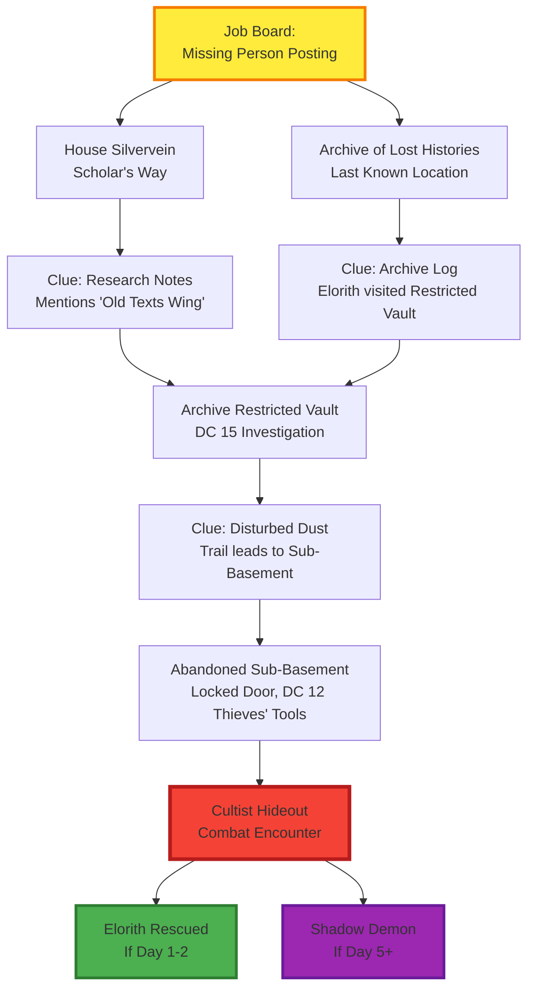

# Missing Person Investigation

**Tier 3 Job Board Contract** | 100gp + 10 Merit

## Quest Summary

Scholar Elorith Silvervein has been missing for 3 days. Last seen near [[Archive of Lost Histories]]. Family requests discreet investigation.

**What Players Know:**
- Missing person: Elorith Silvervein (half-elf researcher, age 146)
- Last seen: 3 days ago, near Archive
- Family: House Silvervein, Scholar's Way (Tier 3)
- Job posted by: Spouse Mirien Silvervein

**What Players Don't Know (DM Only):**
- Elorith is [[Steel Dragon]]'s next murder target
- [[Chaos Cult]] intercepted Elorith first (faction conflict)
- Time-sensitive: Elorith transforming into Shadow Demon
- Research topic: Pre-Cataclysm bloodlines, [[The Codex]], [[Professor Zero]]'s Archive visit

## Investigation Point Crawl

### Map

### Node 1: House Silvervein

**Location:** Scholar's Way, [[Scholar Quarter]], Tier 3
**Distance from Archive:** 3 blocks west

**Description:**
> A modest two-story townhouse with well-tended window boxes. The door bears the Silvervein family crest - an open book crossed with a quill. You hear anxious voices inside.

**NPC:** Mirien Silvervein (Elorith's spouse)
- **Personality:** Desperate but trying to remain composed, cooperative with investigators
- **Information Freely Given:**
  - Elorith left 3 days ago to visit the Archive (routine research trip)
  - Expected back same day, never returned
  - No enemies Mirien knows of, well-liked by colleagues
  - Recent research topic: "Something about ancient bloodlines and magical evolution"

**Clue (DC 12 Investigation - Elorith's Study):**
- Research notes scattered on desk
- Mentions "Dominion Evolution subjects" and "Old Texts Wing - Restricted Vault"
- Journal entry: *"Visitor to Archive 6 months ago asked about these same subjects. Called himself 'Professor Zero.' Why would he lie about his credentials?"*
- Sketch of dragon anatomy labeled "Reincarnation Vessel Theory"

**Connection:** Points investigators to [[Archive of Lost Histories]] Restricted Vault section

### Node 2: Archive of Lost Histories (Main Entrance)

**Location:** [[Scholar Quarter]], Tier 3
**Landmark:** Grand stone building with carved book motifs, scholars entering/exiting

**Description:**
> The Archive of Lost Histories rises before you - a stolid stone edifice adorned with intricate carvings of open books and quills. Scholars in robes hurry in and out, arms laden with tomes. A bored clerk sits at the entrance desk.

**NPC:** Archive Clerk (nameless functionary)
- **Personality:** Bored, bureaucratic, follows rules strictly
- **Persuasion DC 12 OR Bribe 5gp:** Shares visitor log information
- **Deception DC 15:** Pretend to be authorized researcher

**Clue (Visitor Log):**
- Elorith Silvervein signed in 3 days ago, 2:00 PM
- Destination: "Restricted Vault - Old Texts Wing"
- **Never signed out**
- Only authorized scholars can access Restricted Vault (requires credentials OR Deception DC 15)

**Connection:** Restricted Vault section (lower level, requires authorization)

### Node 3: Restricted Vault (Archive Lower Level)

**Location:** Below main Archive floor, behind locked gate
**Access:** Scholar credentials OR Deception DC 15 OR Stealth DC 16 (when clerk distracted)

**Description:**
> Stone steps descend into cooler air. Behind an iron gate, rows of ancient texts sit on dust-covered shelves. The air smells of old parchment and something... wrong. Like copper and shadow.

**Investigation DC 15:**
- Disturbed dust pattern near back wall
- Drag marks, signs of struggle
- Small bloodstain (half-elf blood if examined)

**Perception DC 14:**
- False bookshelf in back corner (illusion magic, DC 13 Arcana to identify)
- Hidden door behind it (opens to spiral staircase descending further)
- Faint sound of chanting from below (if party listens quietly)

**Clue (If party reads Elorith's last accessed text):**
- Book: *"Bloodlines of the Ancients: Dominion Evolution Studies"*
- Page marked: Dragon reincarnation cycles, how souls transfer between vessels
- Marginal note in Elorith's handwriting: *"Why is the Steel Dragon collecting scholars? What does it need to know?"*

**Connection:** Abandoned Sub-Basement (spiral stairs descend 20 feet)

### Node 4: Abandoned Sub-Basement

**Location:** 20 feet below Restricted Vault, forgotten storage level
**Access:** Spiral stairs from hidden door

**Description:**
> The spiral staircase ends in a cramped chamber thick with cobwebs. This level has been abandoned for decades - broken crates, moldering books, collapsed shelving. A heavy wooden door on the far wall bears fresh scratches around the lock. The temperature drops sharply. Shadows seem to move independently of your light sources.

**Door:** Locked
- **Thieves' Tools DC 12:** Pick the lock
- **Athletics DC 16:** Force the door (alerts cultists inside)
- **Knock spell:** Opens door (alerts cultists to magic use)

**Atmosphere Clues:**
- Cold emanating from beyond the door (unnatural)
- Shadows flickering under door crack
- Faint sound: whimpering (Elorith, if Day 1-2) OR inhuman shrieking (Shadow Demon, if Day 5+)

**Perception DC 15 (while examining door):**
- [[Chaos Cult]] symbol scratched into door frame (coiled serpent eating its tail)
- Fresh boot prints in dust (cultist has been here recently)

**Connection:** Cultist Hideout (ritual chamber beyond door)

### Node 5: Cultist Hideout (Combat Encounter)

**Location:** Converted storage chamber, now ritual site
**Environment:** 30ft × 40ft chamber, low ceiling (8ft), ritual circle in center

**Description:**
> The door opens onto a nightmarish scene. The chamber has been converted into a ritual site - arcane symbols painted in blood cover the walls. In the center, a ritual circle glows with sickly purple light. [Description varies by timing - see below]

**Encounter Timing (Critical):**

#### Day 1-2 (Immediate Response):
**Creatures:** 3 Shadows (CR 1/2 each) + 1 [[Chaos Cult]] Initiate (CR 1)
- **Tactics:** Shadows use Strength Drain to weaken fighters, Initiate casts from cover
- **Elorith Status:** Alive, bound in circle, partially transformed (skin graying, eyes flickering shadow)
- **Escape:** Initiate flees if reduced below 10 HP, uses Misty Step to disappear into walls
- **Success:** DC 15 Medicine check + Greater Restoration (or Remove Curse) stabilizes Elorith

**Read-Aloud (Day 1-2):**
> In the center of the ritual circle, a half-elf lies bound - skin graying, veins dark and visible, eyes flickering between solid and translucent. Three shadow-creatures circle the victim like vultures. A robed figure chants from ancient texts, hands wreathed in dark energy. The cultist's head snaps toward you. "No! Not yet! The transformation isn't complete!"

#### Day 3-4 (Delayed Response):
**Creatures:** 5 Shadows (CR 1/2 each) + 1 [[Chaos Cult]] Initiate (CR 1) + Elorith (partially transformed, hostile but can be subdued)
- **Tactics:** Elorith attacks with shadow-infused claws (1d6+2 necrotic), confused and desperate
- **Elorith Status:** Advanced transformation, DC 17 Medicine + Greater Restoration required
- **Success:** Elorith can be saved but permanently scarred (shadow mark remains)

#### Day 5+ (Too Late):
**Creatures:** 1 Shadow Demon (CR 4) + 2 Shadows (CR 1/2 each)
- **Tactics:** Shadow Demon uses Claws + Claw attack, summons more shadows
- **Elorith Status:** LOST - fully transformed into demon, retains fragmented memories
- **Tragedy:** Demon recognizes family/friends, begs to be killed
- **No escape:** Cultist already departed, ritual complete

**Read-Aloud (Day 5+):**
> The ritual circle is dark, the transformation complete. Where Elorith Silvervein once stood, a shadowy demonic form hovers - translucent, terrifying, wrong. Its eyes flicker with recognition as it sees you. A voice like wind through graves whispers: "I... I remember you. Please... end this. I can't... control..." The demon's form convulses, and shadow claws extend.

**Loot (After Combat):**
- Cultist ritual notes (if captured/killed before escape)
- Reference to "Brother Matthias" ordering the capture
- Note: *"The dragon's art distracts the Council. Perfect timing for our work. Collect scholars who know about dragon reincarnation. Matthias says we're helping the dragon, but I'm not sure it knows..."*
- Map fragment showing tunnel connections from Archive to [[The Depths]] (Tier 7)

**Evidence (Investigation DC 12):**
- Ritual circle uses same symbols as [[Steel Dragon]] murder scenes (connection!)
- Cult is manipulating the dragon while claiming to serve it
- This was an extraction operation, not a murder - they wanted Elorith's knowledge

## Rewards

### Base Reward
- **100 gp** (from family)
- **10 Merit** (job board completion)

### Success Bonuses

**If Elorith Rescued (Day 1-2):**
- **+50 gp** bonus from grateful family
- **Restricted Archive Access** granted by Elorith (Tier 3 restricted section, permanent)
- **Information:** Elorith shares research on [[The Codex]] and [[Professor Zero]]'s suspicious visit
- **Ally:** Elorith becomes recurring NPC who researches [[Steel Dragon]] reincarnation cycle

**If Elorith Partially Saved (Day 3-4):**
- **Base reward only**
- **Scarred Ally:** Elorith survives but traumatized, limited help available
- **Archive Access:** Temporary (one visit to restricted section)

**If Failed (Day 5+):**
- **Partial payment:** 50 gp (family distraught but honors contract)
- **No Merit** (investigation failed)
- **Tragedy:** Family blames party for delay
- **Consequence:** [[Steel Dragon]] appears at hideout if party present, adds them to target list

## Player Hooks

**[[Manny]] (Monomi):**
- Elorith's research directly relates to [[The Codex]] quest
- Notes mention [[Professor Zero]]'s Archive visit 6 months ago
- Rescued Elorith grants permanent access to restricted texts about Dominion Evolution bloodlines
- Can provide leads on where [[The Codex]] fragments might be hidden

**All Party:**
- First direct evidence of [[Chaos Cult]] + [[Steel Dragon]] connection
- Cultist notes reveal cult is manipulating dragon (faction conflict brewing)
- Map fragment shows tunnel network connecting [[The Depths]] to upper tiers
- Success earns [[Merit Council]] recognition (10 Merit unlock higher tier access)

## Clock Integration

**Clock: [[Steel Dragon]] Murder Timeline [3/6]**

**Current State (Tick 3):** Dragon has selected Elorith, stalking complete, planning "art piece"

**If Quest Accepted Immediately:**
- Tick pauses at 3/6 - Dragon's timeline disrupted by cult interference
- Party rescues victim before dragon strikes
- **Dragon's Response:** Escalates to Stage 4 (group killings) out of frustration

**If Quest Delayed (3+ days):**
- **Tick 4 (Day 3):** Elorith partially transformed, cult ritual progressing
- **Tick 5 (Day 5):** Elorith fully becomes Shadow Demon
- **Tick 6 (Crisis):** [[Steel Dragon]] discovers art stolen, appears in dragon form at hideout

**Escalation Trigger:**
- If party present when dragon arrives (Day 5+), first direct confrontation
- Dragon: *"You... you let my art be RUINED? By these chaos-mongering insects?"*
- Dragon adds party to next "group art" target list

## DM Notes

**Investigation Paths:**
- Party can start at either Family or Archive (both lead to Restricted Vault)
- Branching paths converge - no wrong approach
- Time pressure creates urgency (ticking clock visible through Elorith's condition)

**Faction Dynamics:**
- [[Chaos Cult]] doesn't serve [[Steel Dragon]] - they're using the dragon's murders as cover
- Cult wants scholars' knowledge about dragon reincarnation for own ritual purposes
- Brother Matthias (cult leader) is manipulating dragon while dragon thinks cult worships it

**Future Connections:**
- Sub-basement tunnel connects to larger underground network (session 4+ content)
- Rescued Elorith becomes research ally throughout campaign
- Cultist escape sets up future confrontation with Brother Matthias
- Dragon confrontation (if triggered) escalates main campaign arc

**Timing Meta:**
- Designed to reward immediate action (Day 1-2 = best outcome)
- Punishes procrastination (Day 5+ = tragedy)
- Shows clocks have real consequences
- Teaches players that job board quests aren't infinite-duration MMO quests

## Related Content

- [[Session 3 - The Steel Dragon Begins]] (quest source)
- [[Steel Dragon]] (antagonist)
- [[Chaos Cult]] (faction)
- [[Archive of Lost Histories]] (location)
- [[Scholar Quarter]] (district)
- [[The Depths]] (connected via tunnels)
- [[The Codex]] (Manny's quest connection)
- [[Professor Zero]] (mysterious visitor)
