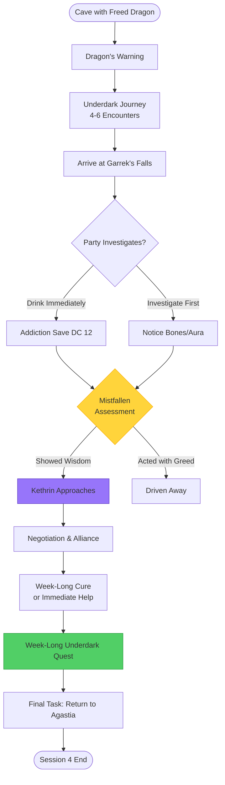

## Session Summary (What Actually Happened)

### Encounters

**Encounter 1: Golem & Ooze**
- CR 5 Golem (AC reduced to 15 for balance)
- Ochre Jelly (CR 2)
- *Outcome:* Party victorious

**Encounter 2: Beast Gauntlet**
- Minotaur (CR 3)
- Giant Snake (CR 2)
- Giant Scorpion (CR 3)
- Golgari Shaman (CR 5)
- *Outcome:* Party victorious - wild fight!

### Arrival at Garrek's Falls

- Party reached Garrek's Falls
- Considering turning back at this point
- **Monomi's Investigation:** Rolled investigation on the room
- **Discovery:** Found a secret door hidden behind the falls

### Loot

**From the Golgari Shaman:**

**[[Item_Mistfall_Shamans_Journal]]** - Weathered leather bound with sinew, fungal stains on the cover, written in Common with occasional Undercommon marginalia. Contains decades of entries chronicling the writer's time guarding the falls, his relationship with the Mistfallen tribe, and his gradual descent into isolation.

**Magic Items:**
- **Eyes of Charming** (Uncommon, requires attunement) - Lenses of smoky quartz set in copper wire frames
- **Elemental Gem (Earth)** - Khaki-colored stone containing a bound Earth Elemental
- **Heward's Handy Spice Pouch** (Common) - Embroidered with mushroom motifs

**Spell Components:**
- **Pearl** (100 gp) - Suitable for *Identify*
- **Diamond** (300 gp) - Suitable for *Revivify*

**Gemstones:**
- **Red Corundum** (50 gp) - Deep crimson, similar color to the mind-control crystals

**Gold:** 45 gp in mixed coinage

---

# Session 4: Journey to Garrek's Falls - DM Guide

**Party:** Level 3 (5 PCs) | **Duration:** 3-4 hours | **Type:** Underdark Exploration & Faction Contact

## Session Flowchart

## Quick Reference

**Toggle: Session Flow**
  1. **Dragon's Warning:** The freed green dragon guides party toward Garrek's Falls and warns about the water's danger
  2. **Underdark Journey:** 4-6 encounters using 2d6 encounter table (mind-controlled creatures, crystal-corrupted hazards, desperate addicts)
  3. **Arrival at Garrek's Falls:** First sight of the legendary location - beautiful, tempting, dangerous
  4. **The Test:** Mistfallen scouts observe how party handles the Falls (drink immediately? investigate first?)
  5. **Contact:** If party shows wisdom, Kethrin approaches under flag of truce
  6. **Negotiation:** Alliance formation - cure in exchange for help
  7. **Week-Long Quest:** Party stays with tribe, explores Underdark, addresses problems (content TBD)
  8. **Agastia Mission:** Final task sends party back to surface (sets up Lyria connection)

**Toggle: Key NPCs**
  - **Green Dragon (freed):** Guide and narrator, warns party about water's addictive properties
  - **Kethrin:** Mistfallen elder/shaman (CR 2), controls crystal network, performs cure rituals
  - **Darva:** Scout leader (CR 1/2), observes party from shadows, makes first assessment
  - **Finn:** Young artisan (CR 1/4), sympathetic to outsiders, acts as cultural bridge
  - **Morvek:** Caretaker (CR 1/4), presents harsh realities of addiction, challenges idealism

**Toggle: Important Locations & Items**
  - **Garrek's Falls:** Legendary location with healing/addictive water (see Location_Garreks_Falls.md)
  - **Red Crystal Network:** Mind control system used by Mistfallen for protection
  - **Mistfallen Settlement:** Hidden deeper in Underdark (week-long content TBD)
  - **Healing Water (potential):** Regrows limbs, cures disease, raises dead (<72hr), restores all HP

**Toggle: Key Mechanics**
  - **Addiction DC 12 Wisdom Save:** Fail = compulsion to drink until drowning
  - **Crystal Vulnerability:** All who drink have disadvantage on saves vs. red crystal mind control
  - **Cure Options:** Kethrin's daily ritual (24hr suppression) or week-long ritual (permanent cure)
  - **Mistfallen Testing:** Party observed throughout - wisdom, restraint, mercy are valued

## Session Opening: The Dragon's Warning

**Setup:** Party is at the cave entrance where they destroyed the mind control crystal and freed the green dragon in Session 3. The path ahead leads deeper into the Underdark toward Garrek's Falls.

**Read-Aloud:**

> The green dragon, now freed from the crystal's control, shakes its head as if clearing cobwebs. Its eyes focus on you with startling intelligence. The cavern behind you still echoes with the shattered remains of the red crystal you destroyed.
>
> "You... broke the chain," the dragon rumbles, its voice carrying a mix of gratitude and warning. "Few have the strength. The path ahead leads to the Falls. Beautiful. Deadly."
>
> The dragon's gaze grows distant, as if remembering something painful. "I drank the waters when the crystal released me—the clarity was... intoxicating. I wanted more. I barely resisted." Its tail sweeps toward skeletal remains visible in a nearby pool. "The Mistfallen will be watching you. They test all who approach."
>
> The dragon fixes you with an intense stare. "Break their crystals, and they know you have strength. But strength is not wisdom. Prove you have both, and they may speak with you. Prove otherwise..." The dragon's voice trails off, leaving the consequence unspoken but clear.

**Dragon's Guidance:**
- Will point party in direction of Falls (8-12 hours travel deeper into Underdark)
- Warns about red crystals along the path ("More guardians. Be mindful.")
- Notes Mistfallen scouts will be watching ("You will not see them, but they see you.")
- May stay in area or depart (DM choice - could return later if needed)

**Party Goals:**
At this point, party should understand:
- They're heading to Garrek's Falls (dragon mentioned it)
- The water is powerful but dangerous (addictive)
- They're being tested/observed by the Mistfallen
- How they act matters (strength + wisdom)

## Underdark Journey to Garrek's Falls

**Distance & Duration:** 8-12 hours of travel deeper into the Underdark
**Encounters:** 4-6 encounters rolled on Underdark Crystal Encounters table

### 2d6 Encounter Table (Level 3 Party)

**Rolling:** 2d6 per 2-hour travel segment

**2d6 Roll 2:** 2 Hook Horrors (addicted) - CR 3 each
- **Theme:** Desperate Addicts
- **Description:** Violent, erratic behavior. Foam at mouth, claw marks on walls from trying to dig toward Falls
- **Tactics:** Mindless aggression, fight to the death

**2d6 Roll 3:** 1d4+1 Grimlocks (tribal) - CR 1/4 each
- **Theme:** Desperate Addicts
- **Description:** Some addicted, some not. Tribal group living in Underdark
- **Non-Combat:** Possible negotiation if party shows mercy and doesn't claim to seek the water

**2d6 Roll 4:** 2 Darkmantles + Red Crystal Formation - CR 1/2 each
- **Theme:** Mind-Controlled
- **Description:** Attached to red crystal cluster, drop on intruders from ceiling
- **Liberation:** Crystal can be destroyed to free them (may flee or be confused)

**2d6 Roll 5:** 1 Carrion Crawler - CR 2
- **Theme:** Desperate Addicts
- **Description:** Feeding on skeletal remains of failed seekers. Trail of bones leads toward Falls
- **Environment:** Scattered remains tell story of past victims

**2d6 Roll 6:** 2 Piercers near Crystal Choke Point - CR 1/2 each
- **Theme:** Mind-Controlled
- **Description:** Disguised as stalactites, creates narrow passage
- **Detection:** DC 15 Perception to spot before they drop

**2d6 Roll 7:** 1d3 Violet Fungi + Crystal Cluster - CR 1/4 each
- **Theme:** Crystal-Corrupted
- **Description:** Growing around pulsing red crystals. Hazardous zone
- **Non-Combat:** Can bypass with successful DC 13 Stealth or find alternate route

**2d6 Roll 8:** 1 Ochre Jelly (feeding on crystal) - CR 2
- **Theme:** Crystal-Corrupted
- **Description:** Translucent with red glow inside
- **Tactics:** Splits when damaged by slashing. Lightning vulnerability

**2d6 Roll 9:** 2 Quaggoths (controlled) - CR 2 each
- **Theme:** Mind-Controlled
- **Description:** Patrolling the area, under crystal influence
- **Liberation:** Breaking nearby crystal frees them, may become allies or flee in confusion

**2d6 Roll 10:** 1 Rust Monster + Crystal Formation - CR 1/2
- **Theme:** Crystal-Corrupted
- **Description:** Attracted to crystal energy. Dangerous for armored PCs
- **Non-Combat:** Can be lured away with metal objects

**2d6 Roll 11:** Crystal Guardian Construct - CR 1
- **Theme:** Mind-Controlled
- **Description:** Use Animated Armor stats. Made of crystalline shards, guards key passage
- **Appearance:** Red crystals form humanoid shape, attacks intruders

**2d6 Roll 12:** Roll Twice
- Roll 2d6 twice, keep both results
- Encounters happen simultaneously or in sequence (DM choice)
- Represents heightened danger or bad luck

### Encounter Themes Explained

**Mind-Controlled (rolls 4, 6, 9, 11):**
- Creatures controlled by red crystals can be freed by destroying nearby crystal
- May become grateful or simply flee in confusion
- Freeing them shows mercy (observed by Mistfallen scouts)

**Crystal-Corrupted (rolls 7, 8, 10):**
- Environmental hazards mixed with creatures
- Emphasize the crystals' strange influence on Underdark ecology
- Not hostile by intent, just dangerous

**Desperate Addicts (rolls 2, 3, 5):**
- Tragic encounters with creatures driven mad by water addiction
- Some may be pitied, others are too far gone
- Shows consequences of the Falls' power

**Non-Combat Options:**
Emphasize that combat isn't always necessary:
- **Grimlocks (roll 3):** Can negotiate if party shows they're not seeking water greedily
- **Rust Monster (roll 10):** Can be lured/distracted with metal objects
- **Violet Fungi (roll 7):** Can bypass with DC 13 Stealth or alternate route
- **Freed Creatures (any mind-controlled):** Breaking crystals may earn gratitude or confusion

**Mistfallen Observation:**
- Darva and 2-4 scouts shadow the party throughout journey
- DC 18 Perception to notice being followed
- They observe: Does party show mercy? Kill unnecessarily? Investigate before acting?
- Report back to Kethrin about party's character

### Environmental Description

Use these details to set atmosphere during travel:

**Increasing Moisture:**
As party gets closer to Falls, moisture increases. Clothes feel damp, water droplets on walls, distant sound of rushing water.

**Red Crystal Frequency:**
More red crystals appear - embedded in walls, ceiling, formations. They pulse with dim light (60 ft radius), creating eerie atmosphere.

**Signs of the Mistfallen:**
- Carved symbols on walls (warning markers in Deep Gnome script - "Turn back" / "Sacred site ahead")
- Subtle paths worn by foot traffic (tribe uses these routes)
- Hidden observation posts (DC 18 Investigation to spot camouflaged openings)

**Evidence of Addiction:**
- Skeletal remains near crystal formations (victims who couldn't resist)
- Claw marks on walls pointing toward Falls
- Discarded equipment from past seekers

## Arrival at Garrek's Falls

**Timing:** After 4-6 encounters, party arrives at the Falls cavern
**Atmosphere:** Shift from dangerous/creepy to beautiful/tempting

**Read-Aloud:**

> The sound of rushing water grows louder, echoing through the tunnel ahead. The passage opens into a vast cavern, and the sight before you takes your breath away.
>
> Cascading from a hole in the ceiling far above, water crashes down in a roaring torrent, yet the streams seem to defy gravity—arcing sideways, spiraling upward, dancing through the air in impossible patterns. Flashes of crimson light play through the gravity-defying streams, cast from red crystals embedded in the cavern ceiling like a constellation of stars.
>
> At the center of it all, a crystalline pool beckons, its surface perfectly still despite the chaos above. The sweet scent of lavender and honey fills the air, and you feel warmth spreading through your body, easing aches and pains you'd forgotten you had. The pool's bottom shimmers with white sand, illuminated periodically by flashes of red light.
>
> It is beautiful. It is otherworldly. And something about it feels... dangerous.

**Automatic Effects:**

**Lesser Restoration Aura:**
- All creatures in cavern continuously benefit from Lesser Restoration spell
- Fatigue fades, minor wounds close, poisons ease
- DC 14 Intelligence (Medicine) check: "It's the moisture in the air. It carries some kind of enchantment."

**The Temptation:**
- Anyone who can see the pool must make DC 10 Wisdom save or feel strong urge to approach and drink
- Not compulsion (can be resisted), just strong desire
- The water looks incredibly refreshing after the journey

### Investigation Opportunities

**Skeletal Remains (DC 20 Perception):**
> Looking closer at the pool's bottom, you notice something among the white sand—shapes that shouldn't be there. Bones. Dozens of skeletons lie at the bottom of the pool, some still wearing armor or clutching weapons. They all face upward, toward the surface, as if they drowned trying to drink.

**Red Crystal Ceiling (DC 14 Investigation):**
> The flashing crimson lights aren't emanating from the water itself—they're reflections. Looking up, you see the cavern ceiling is embedded with hundreds of red crystals, just like the ones you've seen throughout your journey. Water flowing over them catches and refracts their light.

**Hidden Passages (DC 18 Investigation):**
> Behind the waterfalls and along the cavern walls, you notice subtle irregularities—openings concealed by the play of light and shadow. Someone could be watching from those positions without being seen.

**Mistfallen Tribal Markers (DC 15 Survival):**
> Carved into the stone near the cavern entrance are symbols in Deep Gnome script. They read: "Waters of healing, waters of binding. Approach with wisdom, depart with life."

### The Test: What Does the Party Do?

**Mistfallen scouts (Darva + 2-4 others) are watching from hidden observation posts.**

**Positive Signs (increases chance of peaceful contact):**
- Party investigates before drinking
- They notice the bones and discuss the danger
- They show caution and restraint
- They remember the dragon's warning
- They look for information rather than rushing to take

**Negative Signs (may result in hostile response):**
- Immediately rushing to drink without investigation
- Trying to bottle large amounts of water
- Ignoring obvious warning signs
- Acting with greed or entitlement
- Attacking any creatures in the area

**If Party Member Drinks:**

**Addiction Save:** DC 12 Wisdom saving throw
- **Success:** Water grants full healing benefits (see below), but permanent disadvantage on saves vs. red crystal mind control. Character feels incredibly refreshed and tempted to drink more.
- **Failure:** Water grants full healing benefits, but character becomes addicted. They will do everything in their power to return to the pool and drink until they drown. Only Remove Curse, Greater Restoration, or Kethrin's ritual can cure.

**Healing Benefits (single draught):**
- Regrow any lost limbs
- Restore all lost hit points
- Cure any mundane disease
- Raise from death (if dead less than 72 hours)

**If Character Becomes Addicted:**
- Immediately tries to return to pool for more
- Party must restrain them (opposed Athletics/Acrobatics checks)
- This becomes the hook for Mistfallen contact (they intervene to prevent drowning)

## Mistfallen Contact

**Trigger:** After party has had time to investigate (5-10 minutes) OR if party member becomes addicted

**Darva's Assessment:**
Based on party's behavior, Darva reports to Kethrin via crystal network:
- "They freed the dragon and showed mercy" (positive)
- "They investigated before drinking" (positive) OR "They rushed to drink" (negative)
- "They noticed the bones and warnings" (positive) OR "They ignored the signs" (negative)

### Scenario A: Peaceful Contact (Party Showed Wisdom)

**Read-Aloud:**

> A voice speaks from behind you, calm but firm. "You broke the guardian crystal, yet the dragon lives. Few surface-dwellers show such restraint."
>
> Emerging from concealed passages behind the waterfalls, several figures approach. They move with practiced ease through the cavern, their bright red hair catching the crimson light from above. Geometric patterns of freckles mark their pale faces like constellations.
>
> The eldest among them, leaning on a staff topped with a red crystal, steps forward. Their hair is streaked with white, and their eyes reflect the light like the crystals themselves. "I am Kethrin, elder of the Mistfallen. You have come far and overcome much. Will you speak with us?"

**Initial Conversation:**
- Kethrin is accompanied by Darva (watchful, hand on weapon) and Finn (curious, eager)
- Tone is cautious but not hostile
- Kethrin wants to understand party's intentions
- Key questions: "Why do you seek the Falls?" / "What do you know of the water?" / "How did you break the crystal's hold?"

**Building Trust:**
- Party can explain their journey (freed dragon, followed path)
- Mention Ghost of Elaris quest (Mistfallen will explain the herding mistake)
- Ask about the water's danger (Kethrin appreciates wisdom in asking)
- Show respect for the tribe's guardianship

**Kethrin's Explanation:**

> "We are the Mistfallen, guardians of this sacred place. For generations, we have protected the Falls—not from those who would destroy it, but from those who would be destroyed by it. The water heals, yes. But it also binds. It addicts. It consumes."
>
> [Kethrin gestures to the pool bottom] "Every season, we bury those who thought themselves wiser than the warning. Powerful warriors. Desperate healers. Dying seekers. All the same in the end—bones at the bottom, still reaching for one more sip."
>
> [Kethrin's expression softens slightly] "But you... you show restraint. Curiosity before greed. Mercy where you could have shown cruelty. Perhaps the surface world can still surprise us."

### Scenario B: Intervention (Party Member Addicted)

**Read-Aloud:**

> As [character name] struggles against your restraint, figures emerge from concealed passages around the cavern. Several carry nets and weighted ropes, clearly prepared for this exact situation.
>
> An elder with red hair streaked with white steps forward, their staff's crystal glowing brighter. "[Character name], hear my voice. The water lies. The clarity you seek will destroy you. I can help, but you must let me."
>
> The elder touches their staff to the ground, and the red crystal at its tip pulses. You see [character]'s expression shift—the maddened desperation fading to confused awareness.

**Kethrin's Ritual:**
- Uses crystal staff to perform emergency suppression (1st-level spell slot)
- Addicted character feels compulsion fade for 24 hours
- Kethrin explains: "This is temporary. The hunger will return. But I can cure you fully... if you help us."

**This Becomes the Hook:**
- Party needs Kethrin's week-long cure ritual
- Creates leverage but also opportunity for alliance
- Kethrin isn't exploitative—genuinely wants to help but needs help in return

### Scenario C: Hostile Response (Party Acted with Greed)

**Only use if party:**
- Attacked scouts/observers
- Tried to bottle massive amounts of water
- Showed complete disregard for warnings
- Killed unnecessarily during journey

**Read-Aloud:**

> The cavern suddenly fills with movement. Figures emerge from behind waterfalls, from concealed tunnels, surrounding you. All have bright red hair and carry weapons—shortbows drawn, arrows nocked.
>
> A voice echoes through the chamber, amplified by the acoustics: "You have shown neither wisdom nor restraint. The Falls are not for those who would take without understanding, who would destroy without mercy. Leave now, or face the guardians you so carelessly killed."

**Encounter:**
- 4-6 Mistfallen scouts (CR 1/2 each) + crystal-controlled creatures
- Darva leads them, uses crystal shard to summon guardians
- Goal is to drive party away, not kill (unless party escalates)
- If party surrenders/retreats, may get second chance later

**Recovery Option:**
- If party later shows remorse or wisdom, Mistfallen may give second chance
- Harder to earn trust after hostile first contact

## Negotiation & Alliance Formation

**Assuming peaceful contact was established:**

### The Tribe's Situation

**Kethrin explains the problems:**

> "Our crystal network is failing. For generations, we used the crystals to control creatures—frogs as scouts, spiders as guards, larger beasts as sentinels. A protective barrier to keep the desperate away from the Falls. But corruption spreads from deeper in the Underdark. The Chaos Cult, we believe. Our magic weakens, and more addicts break through our defenses."

**Finn adds context (enthusiastically):**

> "We're not trying to hurt anyone! The crystals guide addicted creatures to containment areas where—" [Finn glances at Morvek] "—where we can help them if possible, or... or prevent suffering if not. But the system is breaking down. We can't keep up."

**Morvek presents harsh reality (bluntly):**

> "Every week I put down another creature that couldn't resist. Sometimes they're conscious enough to beg. Sometimes they thank me. It never gets easier. And now there are more of them—too many for us to handle alone."

### The Offer

**Kethrin's proposal:**

> "We need help we cannot find in the darkness. Problems that require... surface resources. Surface allies." [Kethrin studies the party carefully] "If you aid us, we will cure any addiction—permanent cure, not temporary suppression. We will share our knowledge of the Underdark. And for true emergencies, when healing is needed and no other option exists, we will permit limited use of the water. But we must trust you first."

**What the Mistfallen Need:**
1. **Immediate:** Help with local Underdark problems (week-long quest content - TBD via point-crawl)
2. **Chaos Cult Corruption:** Deal with source of corruption spreading through crystal network
3. **Addicted Creatures:** Help contain or cure creatures seeking the Falls
4. **Final Task:** Return to Agastia to [retrieve/contact/deliver something] for the tribe (sets up Lyria connection)

**What Party Gets:**
- Full addiction cure (if needed) via week-long ritual
- Limited water access (for emergencies, Mistfallen's judgment)
- Underdark knowledge and safe passage through Mistfallen territory
- Finn as occasional guide/interpreter
- Ongoing faction alliance

### The Week-Long Cure (If Applicable)

**If party member is addicted OR party agrees to help:**

**Kethrin explains the ritual:**

> "The full cure takes seven days. Each dawn and dusk, I must perform the ritual, channeling the crystal's energy to sever the water's hold on your mind. You must stay within our settlement, where the crystal network is strongest. During this time, you may explore our territory, aid us with our troubles, and learn why we fight so hard to guard this terrible blessing."

**Mechanical Details:**
- Requires staying with Mistfallen for 1 week (in-game time)
- Kethrin performs ritual twice per day (1 hour each)
- After 7 days, addiction is permanently cured
- Party can adventure during the day while ritual subject rests

**This Opens Up:**
- Week-long Underdark point-crawl (content to be developed)
- Relationship building with Mistfallen NPCs
- Investigation of Chaos Cult corruption
- Discovery of what Mistfallen need from Agastia

## Session End Options

**Option A: Accept Alliance Immediately**
- Session ends with party agreeing to help Mistfallen
- Next session: Week-long Underdark quest (point-crawl)
- Time to prepare: Mistfallen provide safe rest, supplies, guidance

**Option B: Need Time to Decide**
- Session ends with party considering offer
- Mistfallen grant safe rest in their settlement
- Next session: Final decision + consequences

**Option C: Decline and Leave**
- Party chooses not to ally (rare, but possible)
- Mistfallen allow peaceful departure (disappointed but respectful)
- Party keeps knowledge of Falls but gets no water/cure
- Future contact possible if party changes mind

**Recommended:** Option A (accept alliance) - creates most story opportunities and ties Underdark content to surface campaign via Agastia mission.

## Key Scenes Checklist

Before session, prepare:
- [ ] Dragon warning speech (opening scene)
- [ ] 4-6 encounters rolled on Underdark table (or roll during session)
- [ ] Falls arrival read-aloud (beauty vs danger)
- [ ] Kethrin's introduction speech (peaceful contact)
- [ ] Mistfallen situation explanation (three voices: Kethrin, Finn, Morvek)
- [ ] Alliance offer and terms (clear what party gets and gives)
- [ ] Addiction rules clarity (DC 12 save, consequences, cure options)

## NPC Roleplay Reference

**Kethrin (Elder/Shaman):**
- Voice: Slow, measured, weary but hopeful
- Tests through questions, not combat
- Quotes: "Every season, we bury those who thought themselves wiser than the warning."
- Goal: Find trustworthy allies, ease the burden

**Darva (Scout Leader):**
- Voice: Short, clipped, always watching
- Suspicious but fair
- Actions speak louder than words
- Goal: Protect tribe, assess threats accurately

**Finn (Young Artisan):**
- Voice: Eager, curious, asks about surface world
- Bridges cultural gaps with enthusiasm
- Quotes: "Is it true the surface has a sky? What does it look like?"
- Goal: Learn about outsiders, maybe find better way than isolation

**Morvek (Caretaker):**
- Voice: Blunt, practical, challenges idealism
- Presents harsh realities without sugar-coating
- Quotes: "You want to help? Start by not drinking the water."
- Goal: Prevent suffering, respects those who make hard choices

## Connections to Campaign

**Session 3 Callbacks:**
- Ghost of Elaris: Mistfallen can explain the herding accident
- Crystal mind control: Party's experience with crystals helps them understand Mistfallen's methods
- Dragon freedom: Cited as evidence of party's mercy/wisdom

**Future Hooks:**
- **Lyria in Agastia:** Red hair + freckle patterns will be recognizable after meeting Mistfallen
- **Chaos Cult:** Corruption threatening Falls ties to main campaign antagonist
- **Week-Long Quest:** Opens up Underdark point-crawl content
- **Agastia Mission:** Creates reason to return to surface with Mistfallen objective

## DM Preparation Checklist

**Before Session:**
- [ ] Read `campaign-content/Locations/Wilderness/Location_Garreks_Falls.md`
- [ ] Read `campaign-content/Factions/Faction_Mistfallen_Tribe.md`
- [ ] Review `Resources/Tables/Underdark_Crystal_Encounters.md`
- [ ] Prepare or roll 4-6 encounters for journey
- [ ] Decide: Will you push for addiction hook or respect player agency?
- [ ] Prepare Mistfallen NPC voices and personalities
- [ ] Consider: What will Mistfallen need from Agastia? (can improvise based on week-long content)

**Session Materials:**
- Druid stat block (CR 2) for Kethrin
- Scout stat block (CR 1/2) for Darva and scouts
- Encounter stat blocks from chosen rolls
- Map or description of Falls cavern layout (if needed for combat)
- Notes on addiction mechanics (DC 12 save, consequences, cures)

**Player Handouts (Optional):**
- Mistfallen tribal marker symbols (visual aid)
- Description of healing water benefits (if they ask)
- Map of Underdark route (abstract, showing journey progress)

## Adventure Design Notes

**Pacing:**
- Opening scene with dragon: 5-10 minutes
- Underdark journey: 1.5-2 hours (bulk of session)
- Arrival at Falls: 15-30 minutes (let players explore/investigate)
- Mistfallen contact: 45-60 minutes (negotiation is key moment)
- Wrap-up and next steps: 10-15 minutes

**Player Agency:**
- Don't force anyone to drink the water (tempt, don't compel)
- Multiple valid responses to Mistfallen offer (accept, decline, negotiate)
- Combat is avoidable if party shows wisdom
- Week-long commitment is significant—make sure players understand stakes

**Encounter Balance:**
- Level 3 party can handle CR 1/2 to CR 2 creatures
- Mix combat and non-combat encounters
- Reward creativity (freeing controlled creatures, avoiding fights)
- Mistfallen scouts should feel like observers, not threats (unless provoked)

**Tone:**
- Shift from dangerous/tense (journey) to beautiful/tempting (Falls) to cautious/hopeful (contact)
- Emphasize Mistfallen as reasonable people with impossible job
- The Falls should feel like a double-edged sword: incredible power, terrible cost
- Alliance should feel earned, not given

**Future Development:**
Track for later sessions:
- [ ] Design week-long Underdark point-crawl (using point-crawl skill)
- [ ] Determine Agastia mission details (what do Mistfallen need?)
- [ ] Develop Lyria's connection to Mistfallen (exile? descendant? spy?)
- [ ] Plan Chaos Cult confrontation in deeper Underdark

## Reference Materials

**Complete Details:**
- **Location:** `campaign-content/Locations/Wilderness/Location_Garreks_Falls.md`
- **Faction:** `campaign-content/Factions/Faction_Mistfallen_Tribe.md`
- **Encounters:** `Resources/Tables/Underdark_Crystal_Encounters.md`
- **Format Guide:** `.claude/skills/legendary-location.md`

**Related Quests:**
- Ghost of Elaris (Session 3) - Mistfallen explain the herding accident
- Chaos Cult corruption (ongoing) - Threatening crystal network
- Josh's backstory (future) - Potential crystal/water connection

**Campaign Themes:**
- Temptation vs. Wisdom
- Guardians with noble motives
- Peaceful solutions over combat
- Everything connects (crystals, water, addiction, protection)
- Choices have weight
